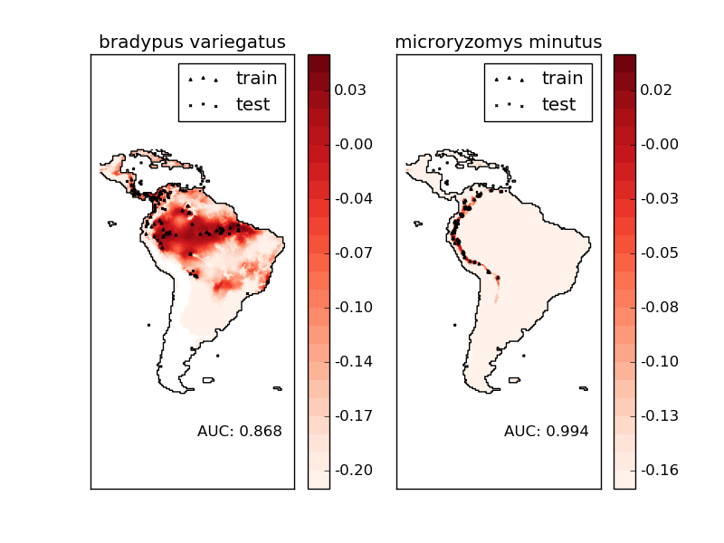

.. _example_applications_plot_species_distribution_modeling.py:

=============================
Species distribution modeling
=============================

Modeling species' geographic distributions is an important
problem in conservation biology. In this example we
model the geographic distribution of two south american
mammals given past observations and 14 environmental
variables. Since we have only positive examples (there are
no unsuccessful observations), we cast this problem as a
density estimation problem and use the `OneClassSVM` provided
by the package `sklearn.svm` as our modeling tool.
The dataset is provided by Phillips et. al. (2006).
If available, the example uses
`basemap <http://matplotlib.sourceforge.net/basemap/doc/html/>`_
to plot the coast lines and national boundaries of South America.

The two species are:

 - `"Bradypus variegatus"
   <http://www.iucnredlist.org/apps/redlist/details/3038/0>`_ ,
   the Brown-throated Sloth.

 - `"Microryzomys minutus"
   <http://www.iucnredlist.org/apps/redlist/details/13408/0>`_ ,
   also known as the Forest Small Rice Rat, a rodent that lives in Peru,
   Colombia, Ecuador, Peru, and Venezuela.

References
----------

 * `"Maximum entropy modeling of species geographic distributions"
   <http://www.cs.princeton.edu/~schapire/papers/ecolmod.pdf>`_
   S. J. Phillips, R. P. Anderson, R. E. Schapire - Ecological Modelling,
   190:231-259, 2006.

**Script output**::

  ________________________________________________________________________________
  Modeling distribution of species 'bradypus variegatus'
   - fit OneClassSVM ... done.
   - plot coastlines from coverage
   - predict species distribution
  
   Area under the ROC curve : 0.868380
  ________________________________________________________________________________
  Modeling distribution of species 'microryzomys minutus'
   - fit OneClassSVM ... done.
   - plot coastlines from coverage
   - predict species distribution
  
   Area under the ROC curve : 0.993919
  
  time elapsed: 8.19s

**Python source code:** :download:`plot_species_distribution_modeling.py <plot_species_distribution_modeling.py>`

.. literalinclude:: plot_species_distribution_modeling.py
    :lines: 38-

**Total running time of the example:**  8.20 seconds
( 0 minutes  8.20 seconds)
    