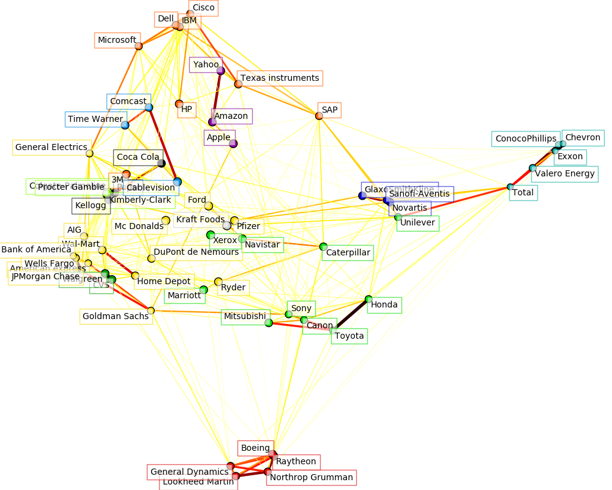

.. _example_applications_plot_stock_market.py:

=======================================
Visualizing the stock market structure
=======================================

This example employs several unsupervised learning techniques to extract
the stock market structure from variations in historical quotes.

The quantity that we use is the daily variation in quote price: quotes
that are linked tend to cofluctuate during a day.

.. _stock_market:

Learning a graph structure
--------------------------

We use sparse inverse covariance estimation to find which quotes are
correlated conditionally on the others. Specifically, sparse inverse
covariance gives us a graph, that is a list of connection. For each
symbol, the symbols that it is connected too are those useful to explain
its fluctuations.

Clustering
----------

We use clustering to group together quotes that behave similarly. Here,
amongst the :ref:`various clustering techniques <clustering>` available
in the scikit-learn, we use :ref:`affinity_propagation` as it does
not enforce equal-size clusters, and it can choose automatically the
number of clusters from the data.

Note that this gives us a different indication than the graph, as the
graph reflects conditional relations between variables, while the
clustering reflects marginal properties: variables clustered together can
be considered as having a similar impact at the level of the full stock
market.

Embedding in 2D space
---------------------

For visualization purposes, we need to lay out the different symbols on a
2D canvas. For this we use :ref:`manifold` techniques to retrieve 2D
embedding.

Visualization
-------------

The output of the 3 models are combined in a 2D graph where nodes
represents the stocks and edges the:

- cluster labels are used to define the color of the nodes
- the sparse covariance model is used to display the strength of the edges
- the 2D embedding is used to position the nodes in the plan

This example has a fair amount of visualization-related code, as
visualization is crucial here to display the graph. One of the challenge
is to position the labels minimizing overlap. For this we use an
heuristic based on the direction of the nearest neighbor along each
axis.

**Script output**::

  Cluster 1: Pepsi, Coca Cola, Kellogg
  Cluster 2: Apple, Amazon, Yahoo
  Cluster 3: GlaxoSmithKline, Novartis, Sanofi-Aventis
  Cluster 4: Comcast, Time Warner, Cablevision
  Cluster 5: ConocoPhillips, Chevron, Total, Valero Energy, Exxon
  Cluster 6: CVS, Walgreen
  Cluster 7: Navistar, Sony, Marriott, Caterpillar, Canon, Toyota, Honda, Mitsubishi, Xerox, Unilever
  Cluster 8: Kimberly-Clark, Colgate-Palmolive, Procter Gamble
  Cluster 9: American express, Ryder, Goldman Sachs, Wal-Mart, General Electrics, Pfizer, Wells Fargo, DuPont de Nemours, Bank of America, AIG, Home Depot, Ford, JPMorgan Chase, Mc Donalds
  Cluster 10: Microsoft, SAP, 3M, IBM, Texas instruments, HP, Dell, Cisco
  Cluster 11: Raytheon, Boeing, Lookheed Martin, General Dynamics, Northrop Grumman
  Cluster 12: Kraft Foods

**Python source code:** :download:`plot_stock_market.py <plot_stock_market.py>`

.. literalinclude:: plot_stock_market.py
    :lines: 62-

**Total running time of the example:**  7.50 seconds
( 0 minutes  7.50 seconds)
    