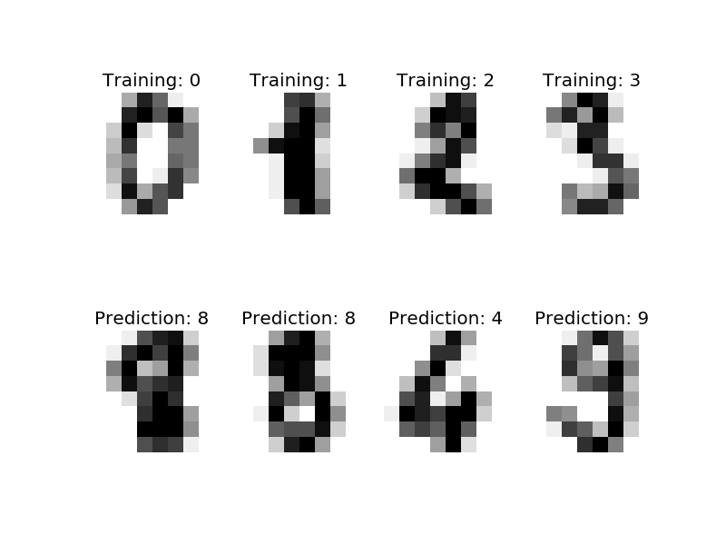

.. _example_classification_plot_digits_classification.py:

================================
Recognizing hand-written digits
================================

An example showing how the scikit-learn can be used to recognize images of
hand-written digits.

This example is commented in the
:ref:`tutorial section of the user manual <introduction>`.

**Script output**::

  Classification report for classifier SVC(C=1.0, cache_size=200, class_weight=None, coef0=0.0,
    decision_function_shape=None, degree=3, gamma=0.001, kernel='rbf',
    max_iter=-1, probability=False, random_state=None, shrinking=True,
    tol=0.001, verbose=False):
               precision    recall  f1-score   support
  
            0       1.00      0.99      0.99        88
            1       0.99      0.97      0.98        91
            2       0.99      0.99      0.99        86
            3       0.98      0.87      0.92        91
            4       0.99      0.96      0.97        92
            5       0.95      0.97      0.96        91
            6       0.99      0.99      0.99        91
            7       0.96      0.99      0.97        89
            8       0.94      1.00      0.97        88
            9       0.93      0.98      0.95        92
  
  avg / total       0.97      0.97      0.97       899
  
  
  Confusion matrix:
  [[87  0  0  0  1  0  0  0  0  0]
   [ 0 88  1  0  0  0  0  0  1  1]
   [ 0  0 85  1  0  0  0  0  0  0]
   [ 0  0  0 79  0  3  0  4  5  0]
   [ 0  0  0  0 88  0  0  0  0  4]
   [ 0  0  0  0  0 88  1  0  0  2]
   [ 0  1  0  0  0  0 90  0  0  0]
   [ 0  0  0  0  0  1  0 88  0  0]
   [ 0  0  0  0  0  0  0  0 88  0]
   [ 0  0  0  1  0  1  0  0  0 90]]

**Python source code:** :download:`plot_digits_classification.py <plot_digits_classification.py>`

.. literalinclude:: plot_digits_classification.py
    :lines: 13-

**Total running time of the example:**  0.58 seconds
( 0 minutes  0.58 seconds)
    