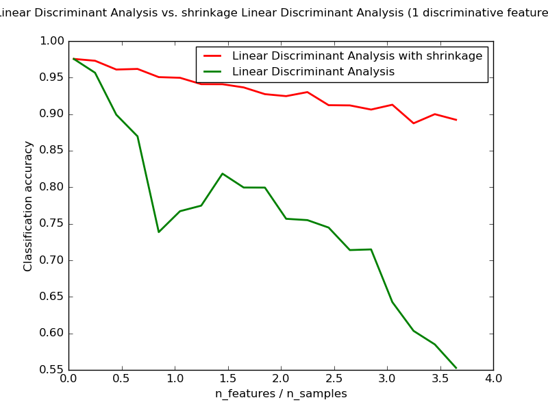

.. _example_classification_plot_lda.py:

====================================================================
Normal and Shrinkage Linear Discriminant Analysis for classification
====================================================================

Shows how shrinkage improves classification.

**Python source code:** :download:`plot_lda.py <plot_lda.py>`

.. literalinclude:: plot_lda.py
    :lines: 8-

**Total running time of the example:**  6.18 seconds
( 0 minutes  6.18 seconds)
    