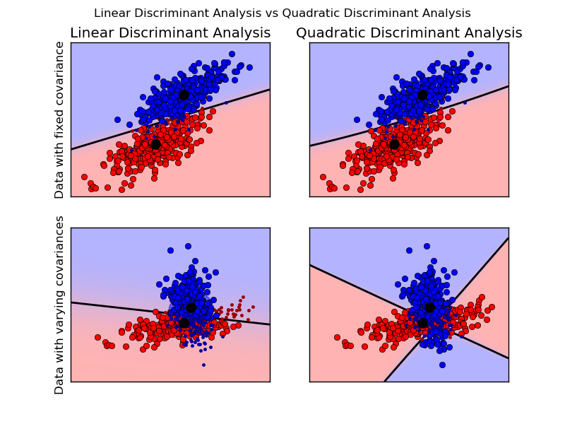

.. _example_classification_plot_lda_qda.py:

====================================================================
Linear and Quadratic Discriminant Analysis with confidence ellipsoid
====================================================================

Plot the confidence ellipsoids of each class and decision boundary

**Python source code:** :download:`plot_lda_qda.py <plot_lda_qda.py>`

.. literalinclude:: plot_lda_qda.py
    :lines: 8-

**Total running time of the example:**  0.27 seconds
( 0 minutes  0.27 seconds)
    