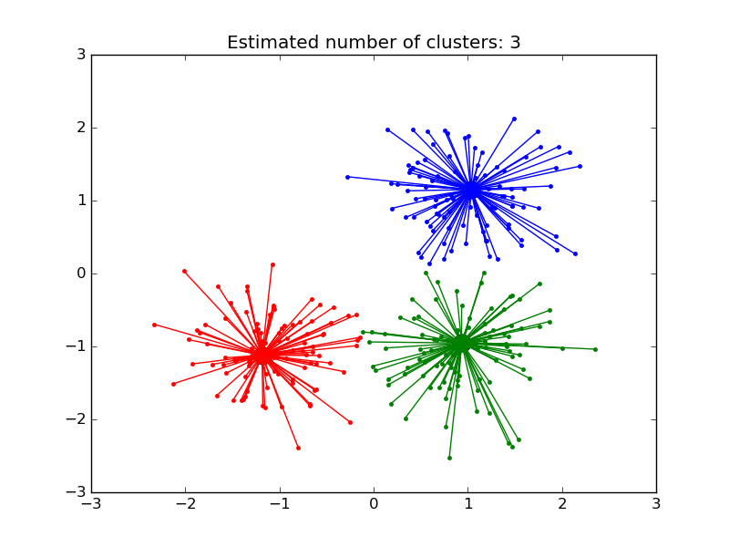

.. _example_cluster_plot_affinity_propagation.py:

=================================================
Demo of affinity propagation clustering algorithm
=================================================

Reference:
Brendan J. Frey and Delbert Dueck, "Clustering by Passing Messages
Between Data Points", Science Feb. 2007

**Script output**::

  Estimated number of clusters: 3
  Homogeneity: 0.872
  Completeness: 0.872
  V-measure: 0.872
  Adjusted Rand Index: 0.912
  Adjusted Mutual Information: 0.871
  Silhouette Coefficient: 0.753

**Python source code:** :download:`plot_affinity_propagation.py <plot_affinity_propagation.py>`

.. literalinclude:: plot_affinity_propagation.py
    :lines: 11-

**Total running time of the example:**  0.82 seconds
( 0 minutes  0.82 seconds)
    