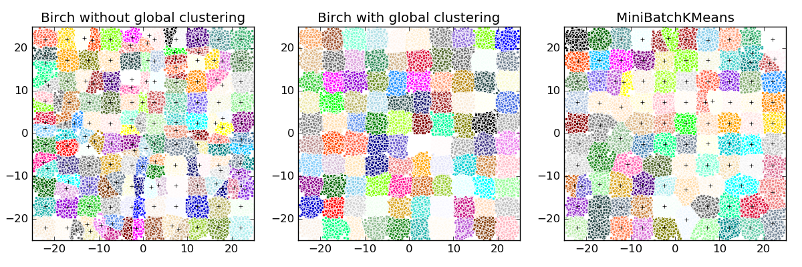

.. _example_cluster_plot_birch_vs_minibatchkmeans.py:

=================================
Compare BIRCH and MiniBatchKMeans
=================================

This example compares the timing of Birch (with and without the global
clustering step) and MiniBatchKMeans on a synthetic dataset having
100,000 samples and 2 features generated using make_blobs.

If ``n_clusters`` is set to None, the data is reduced from 100,000
samples to a set of 158 clusters. This can be viewed as a preprocessing
step before the final (global) clustering step that further reduces these
158 clusters to 100 clusters.

**Script output**::

  Birch without global clustering as the final step took 4.79 seconds
  n_clusters : 158
  Birch with global clustering as the final step took 4.54 seconds
  n_clusters : 100
  Time taken to run MiniBatchKMeans 6.15 seconds

**Python source code:** :download:`plot_birch_vs_minibatchkmeans.py <plot_birch_vs_minibatchkmeans.py>`

.. literalinclude:: plot_birch_vs_minibatchkmeans.py
    :lines: 15-

**Total running time of the example:**  16.74 seconds
( 0 minutes  16.74 seconds)
    