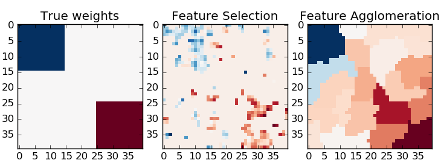

.. _example_cluster_plot_feature_agglomeration_vs_univariate_selection.py:

==============================================
Feature agglomeration vs. univariate selection
==============================================

This example compares 2 dimensionality reduction strategies:

- univariate feature selection with Anova

- feature agglomeration with Ward hierarchical clustering

Both methods are compared in a regression problem using
a BayesianRidge as supervised estimator.

**Script output**::

  ________________________________________________________________________________
  [Memory] Calling sklearn.cluster.hierarchical.ward_tree...
  ward_tree(array([[-0.451933, ..., -0.675318],
         ..., 
         [ 0.275706, ..., -1.085711]]), 
  <1600x1600 sparse matrix of type '<type 'numpy.int64'>'
          with 7840 stored elements in COOrdinate format>, n_components=None, n_clusters=None)
  ________________________________________________________ward_tree - 0.1s, 0.0min
  ________________________________________________________________________________
  [Memory] Calling sklearn.cluster.hierarchical.ward_tree...
  ward_tree(array([[ 0.905206, ...,  0.161245],
         ..., 
         [-0.849835, ..., -1.091621]]), 
  <1600x1600 sparse matrix of type '<type 'numpy.int64'>'
          with 7840 stored elements in COOrdinate format>, n_components=None, n_clusters=None)
  ________________________________________________________ward_tree - 0.1s, 0.0min
  ________________________________________________________________________________
  [Memory] Calling sklearn.cluster.hierarchical.ward_tree...
  ward_tree(array([[ 0.905206, ..., -0.675318],
         ..., 
         [-0.849835, ..., -1.085711]]), 
  <1600x1600 sparse matrix of type '<type 'numpy.int64'>'
          with 7840 stored elements in COOrdinate format>, n_components=None, n_clusters=None)
  ________________________________________________________ward_tree - 0.1s, 0.0min
  ________________________________________________________________________________
  [Memory] Calling sklearn.feature_selection.univariate_selection.f_regression...
  f_regression(array([[-0.451933, ...,  0.275706],
         ..., 
         [-0.675318, ..., -1.085711]]), 
  array([ 25.267703, ..., -25.026711]))
  _____________________________________________________f_regression - 0.0s, 0.0min
  ________________________________________________________________________________
  [Memory] Calling sklearn.feature_selection.univariate_selection.f_regression...
  f_regression(array([[ 0.905206, ..., -0.849835],
         ..., 
         [ 0.161245, ..., -1.091621]]), 
  array([ -27.447268, ..., -112.638768]))
  _____________________________________________________f_regression - 0.0s, 0.0min
  ________________________________________________________________________________
  [Memory] Calling sklearn.feature_selection.univariate_selection.f_regression...
  f_regression(array([[ 0.905206, ..., -0.849835],
         ..., 
         [-0.675318, ..., -1.085711]]), 
  array([-27.447268, ..., -25.026711]))
  _____________________________________________________f_regression - 0.0s, 0.0min

**Python source code:** :download:`plot_feature_agglomeration_vs_univariate_selection.py <plot_feature_agglomeration_vs_univariate_selection.py>`

.. literalinclude:: plot_feature_agglomeration_vs_univariate_selection.py
    :lines: 15-

**Total running time of the example:**  1.09 seconds
( 0 minutes  1.09 seconds)
    