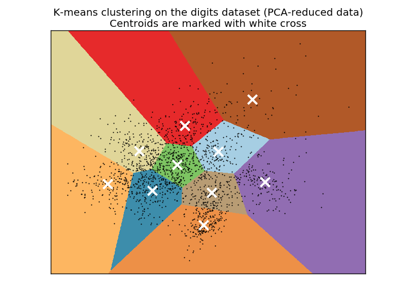

.. _example_cluster_plot_kmeans_digits.py:

===========================================================
A demo of K-Means clustering on the handwritten digits data
===========================================================

In this example we compare the various initialization strategies for
K-means in terms of runtime and quality of the results.

As the ground truth is known here, we also apply different cluster
quality metrics to judge the goodness of fit of the cluster labels to the
ground truth.

Cluster quality metrics evaluated (see :ref:`clustering_evaluation` for
definitions and discussions of the metrics):

=========== ========================================================
Shorthand    full name
=========== ========================================================
homo         homogeneity score
compl        completeness score
v-meas       V measure
ARI          adjusted Rand index
AMI          adjusted mutual information
silhouette   silhouette coefficient
=========== ========================================================

**Script output**::

  n_digits: 10,    n_samples 1797,         n_features 64
  _______________________________________________________________________________
  init    time  inertia    homo   compl  v-meas     ARI AMI  silhouette
  k-means++   0.32s    69432   0.602   0.650   0.625   0.465   0.598    0.146
     random   0.29s    69694   0.669   0.710   0.689   0.553   0.666    0.147
  PCA-based   0.02s    71820   0.673   0.715   0.693   0.567   0.670    0.150
  _______________________________________________________________________________

**Python source code:** :download:`plot_kmeans_digits.py <plot_kmeans_digits.py>`

.. literalinclude:: plot_kmeans_digits.py
    :lines: 28-

**Total running time of the example:**  1.35 seconds
( 0 minutes  1.35 seconds)
    