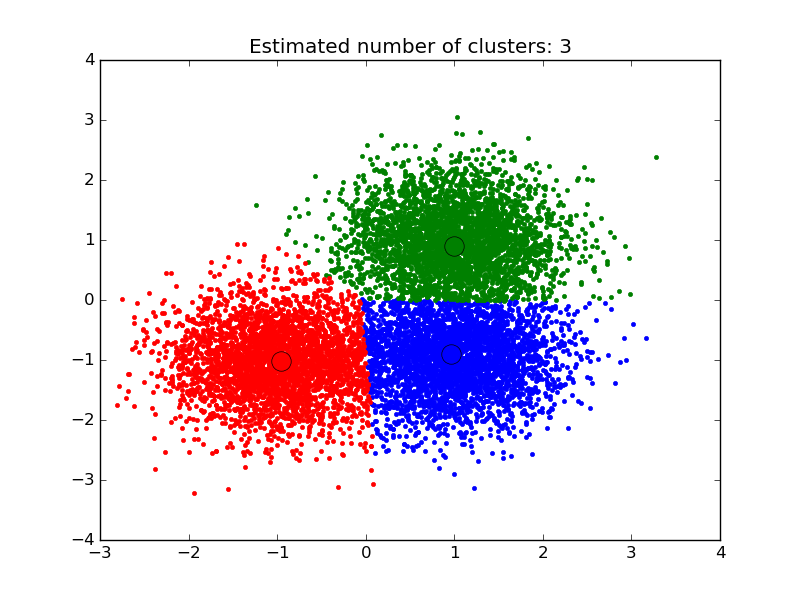

.. _example_cluster_plot_mean_shift.py:

=============================================
A demo of the mean-shift clustering algorithm
=============================================

Reference:

Dorin Comaniciu and Peter Meer, "Mean Shift: A robust approach toward
feature space analysis". IEEE Transactions on Pattern Analysis and
Machine Intelligence. 2002. pp. 603-619.

**Script output**::

  number of estimated clusters : 3

**Python source code:** :download:`plot_mean_shift.py <plot_mean_shift.py>`

.. literalinclude:: plot_mean_shift.py
    :lines: 13-

**Total running time of the example:**  0.41 seconds
( 0 minutes  0.41 seconds)
    