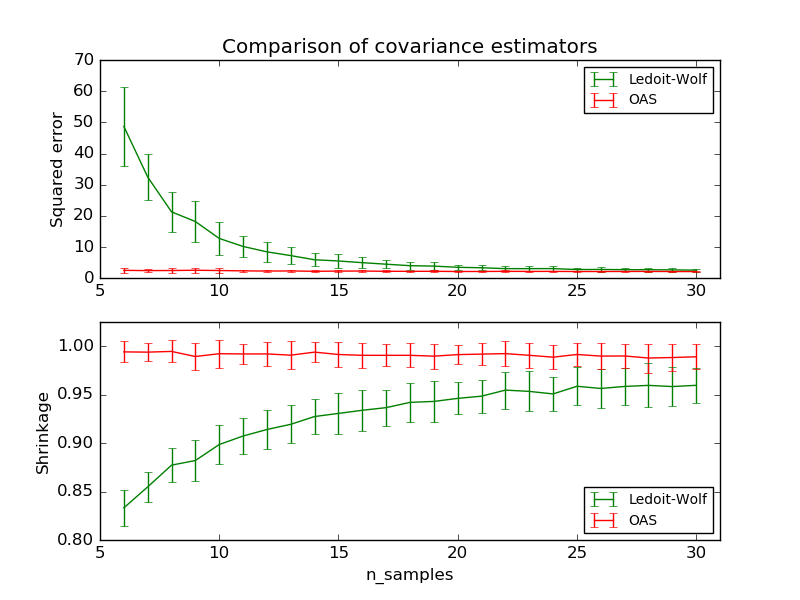

.. _example_covariance_plot_lw_vs_oas.py:

=============================
Ledoit-Wolf vs OAS estimation
=============================

The usual covariance maximum likelihood estimate can be regularized
using shrinkage. Ledoit and Wolf proposed a close formula to compute
the asymptotically optimal shrinkage parameter (minimizing a MSE
criterion), yielding the Ledoit-Wolf covariance estimate.

Chen et al. proposed an improvement of the Ledoit-Wolf shrinkage
parameter, the OAS coefficient, whose convergence is significantly
better under the assumption that the data are Gaussian.

This example, inspired from Chen's publication [1], shows a comparison
of the estimated MSE of the LW and OAS methods, using Gaussian
distributed data.

[1] "Shrinkage Algorithms for MMSE Covariance Estimation"
Chen et al., IEEE Trans. on Sign. Proc., Volume 58, Issue 10, October 2010.

**Python source code:** :download:`plot_lw_vs_oas.py <plot_lw_vs_oas.py>`

.. literalinclude:: plot_lw_vs_oas.py
    :lines: 23-

**Total running time of the example:**  2.73 seconds
( 0 minutes  2.73 seconds)
    