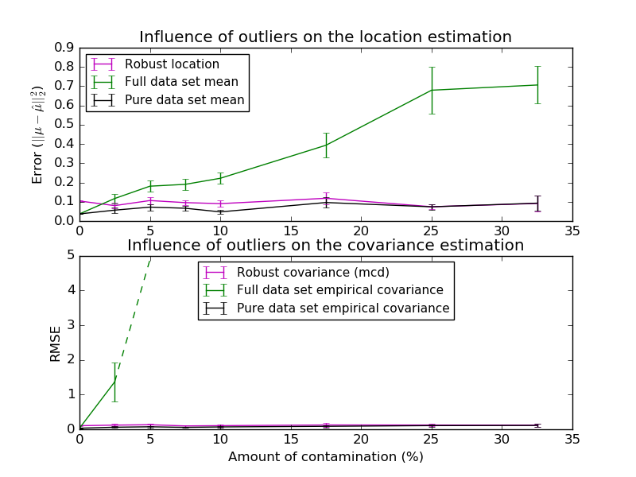

.. _example_covariance_plot_robust_vs_empirical_covariance.py:

=======================================
Robust vs Empirical covariance estimate
=======================================

The usual covariance maximum likelihood estimate is very sensitive to the
presence of outliers in the data set. In such a case, it would be better to
use a robust estimator of covariance to guarantee that the estimation is
resistant to "erroneous" observations in the data set.

Minimum Covariance Determinant Estimator
----------------------------------------
The Minimum Covariance Determinant estimator is a robust, high-breakdown point
(i.e. it can be used to estimate the covariance matrix of highly contaminated
datasets, up to
:math:`\frac{n_\text{samples} - n_\text{features}-1}{2}` outliers) estimator of
covariance. The idea is to find
:math:`\frac{n_\text{samples} + n_\text{features}+1}{2}`
observations whose empirical covariance has the smallest determinant, yielding
a "pure" subset of observations from which to compute standards estimates of
location and covariance. After a correction step aiming at compensating the
fact that the estimates were learned from only a portion of the initial data,
we end up with robust estimates of the data set location and covariance.

The Minimum Covariance Determinant estimator (MCD) has been introduced by
P.J.Rousseuw in [1]_.

Evaluation
----------
In this example, we compare the estimation errors that are made when using
various types of location and covariance estimates on contaminated Gaussian
distributed data sets:

- The mean and the empirical covariance of the full dataset, which break
  down as soon as there are outliers in the data set
- The robust MCD, that has a low error provided
  :math:`n_\text{samples} > 5n_\text{features}`
- The mean and the empirical covariance of the observations that are known
  to be good ones. This can be considered as a "perfect" MCD estimation,
  so one can trust our implementation by comparing to this case.

References
----------
.. [1] P. J. Rousseeuw. Least median of squares regression. J. Am
    Stat Ass, 79:871, 1984.
.. [2] Johanna Hardin, David M Rocke. Journal of Computational and
    Graphical Statistics. December 1, 2005, 14(4): 928-946.
.. [3] Zoubir A., Koivunen V., Chakhchoukh Y. and Muma M. (2012). Robust
    estimation in signal processing: A tutorial-style treatment of
    fundamental concepts. IEEE Signal Processing Magazine 29(4), 61-80.

**Python source code:** :download:`plot_robust_vs_empirical_covariance.py <plot_robust_vs_empirical_covariance.py>`

.. literalinclude:: plot_robust_vs_empirical_covariance.py
    :lines: 54-

**Total running time of the example:**  2.81 seconds
( 0 minutes  2.81 seconds)
    