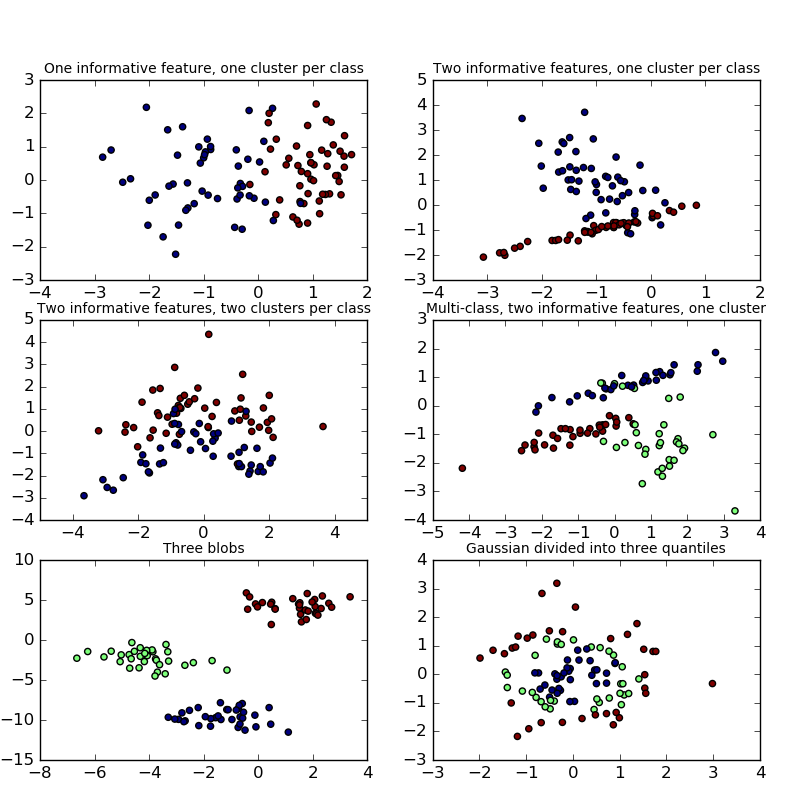

.. _example_datasets_plot_random_dataset.py:

==============================================
Plot randomly generated classification dataset
==============================================

Plot several randomly generated 2D classification datasets.
This example illustrates the :func:`datasets.make_classification`
:func:`datasets.make_blobs` and :func:`datasets.make_gaussian_quantiles`
functions.

For ``make_classification``, three binary and two multi-class classification
datasets are generated, with different numbers of informative features and
clusters per class.  

**Python source code:** :download:`plot_random_dataset.py <plot_random_dataset.py>`

.. literalinclude:: plot_random_dataset.py
    :lines: 14-

**Total running time of the example:**  0.26 seconds
( 0 minutes  0.26 seconds)
    