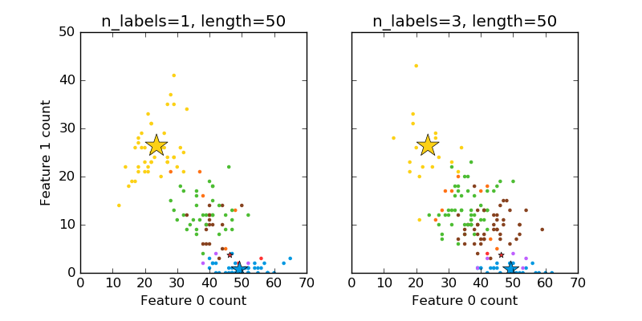

.. _example_datasets_plot_random_multilabel_dataset.py:

==============================================
Plot randomly generated multilabel dataset
==============================================

This illustrates the `datasets.make_multilabel_classification` dataset
generator. Each sample consists of counts of two features (up to 50 in
total), which are differently distributed in each of two classes.

Points are labeled as follows, where Y means the class is present:

    =====  =====  =====  ======
      1      2      3    Color
    =====  =====  =====  ======
      Y      N      N    Red
      N      Y      N    Blue
      N      N      Y    Yellow
      Y      Y      N    Purple
      Y      N      Y    Orange
      Y      Y      N    Green
      Y      Y      Y    Brown
    =====  =====  =====  ======

A star marks the expected sample for each class; its size reflects the
probability of selecting that class label.

The left and right examples highlight the ``n_labels`` parameter:
more of the samples in the right plot have 2 or 3 labels.

Note that this two-dimensional example is very degenerate:
generally the number of features would be much greater than the
"document length", while here we have much larger documents than vocabulary.
Similarly, with ``n_classes > n_features``, it is much less likely that a
feature distinguishes a particular class.

**Script output**::

  The data was generated from (random_state=268):
  Class   P(C)    P(w0|C) P(w1|C)
  red     0.08    0.93    0.07
  blue    0.38    0.99    0.01
  yellow  0.54    0.47    0.53

**Python source code:** :download:`plot_random_multilabel_dataset.py <plot_random_multilabel_dataset.py>`

.. literalinclude:: plot_random_multilabel_dataset.py
    :lines: 36-

**Total running time of the example:**  0.13 seconds
( 0 minutes  0.13 seconds)
    