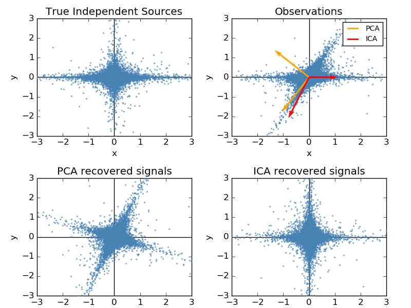

.. _example_decomposition_plot_ica_vs_pca.py:

==========================
FastICA on 2D point clouds
==========================

This example illustrates visually in the feature space a comparison by
results using two different component analysis techniques.

:ref:`ICA` vs :ref:`PCA`.

Representing ICA in the feature space gives the view of 'geometric ICA':
ICA is an algorithm that finds directions in the feature space
corresponding to projections with high non-Gaussianity. These directions
need not be orthogonal in the original feature space, but they are
orthogonal in the whitened feature space, in which all directions
correspond to the same variance.

PCA, on the other hand, finds orthogonal directions in the raw feature
space that correspond to directions accounting for maximum variance.

Here we simulate independent sources using a highly non-Gaussian
process, 2 student T with a low number of degrees of freedom (top left
figure). We mix them to create observations (top right figure).
In this raw observation space, directions identified by PCA are
represented by orange vectors. We represent the signal in the PCA space,
after whitening by the variance corresponding to the PCA vectors (lower
left). Running ICA corresponds to finding a rotation in this space to
identify the directions of largest non-Gaussianity (lower right).

**Python source code:** :download:`plot_ica_vs_pca.py <plot_ica_vs_pca.py>`

.. literalinclude:: plot_ica_vs_pca.py
    :lines: 30-

**Total running time of the example:**  0.45 seconds
( 0 minutes  0.45 seconds)
    