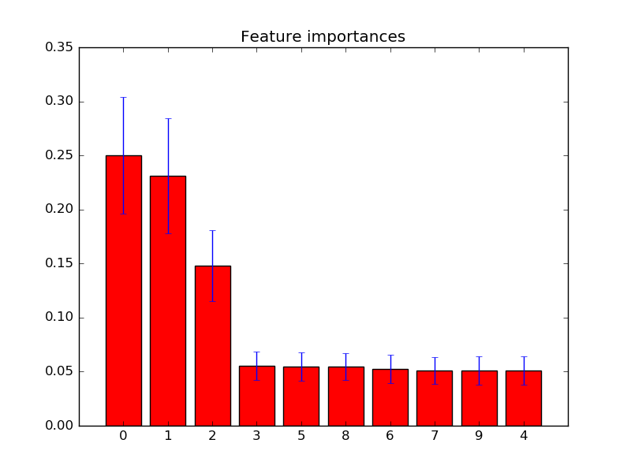

.. _example_ensemble_plot_forest_importances.py:

=========================================
Feature importances with forests of trees
=========================================

This examples shows the use of forests of trees to evaluate the importance of
features on an artificial classification task. The red bars are the feature
importances of the forest, along with their inter-trees variability.

As expected, the plot suggests that 3 features are informative, while the
remaining are not.

**Script output**::

  Feature ranking:
  1. feature 0 (0.250402)
  2. feature 1 (0.231094)
  3. feature 2 (0.148057)
  4. feature 3 (0.055632)
  5. feature 5 (0.054583)
  6. feature 8 (0.054573)
  7. feature 6 (0.052606)
  8. feature 7 (0.051109)
  9. feature 9 (0.051010)
  10. feature 4 (0.050934)

**Python source code:** :download:`plot_forest_importances.py <plot_forest_importances.py>`

.. literalinclude:: plot_forest_importances.py
    :lines: 13-

**Total running time of the example:**  0.64 seconds
( 0 minutes  0.64 seconds)
    