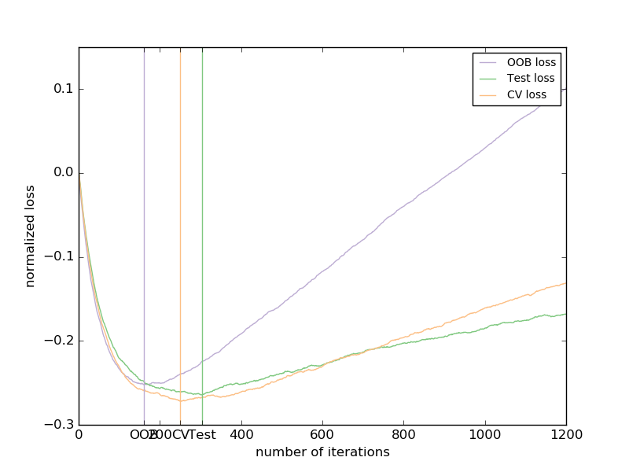

.. _example_ensemble_plot_gradient_boosting_oob.py:

======================================
Gradient Boosting Out-of-Bag estimates
======================================

Out-of-bag (OOB) estimates can be a useful heuristic to estimate
the "optimal" number of boosting iterations.
OOB estimates are almost identical to cross-validation estimates but
they can be computed on-the-fly without the need for repeated model
fitting.
OOB estimates are only available for Stochastic Gradient Boosting
(i.e. ``subsample < 1.0``), the estimates are derived from the improvement
in loss based on the examples not included in the bootstrap sample
(the so-called out-of-bag examples).
The OOB estimator is a pessimistic estimator of the true
test loss, but remains a fairly good approximation for a small number of trees.

The figure shows the cumulative sum of the negative OOB improvements
as a function of the boosting iteration. As you can see, it tracks the test
loss for the first hundred iterations but then diverges in a
pessimistic way.
The figure also shows the performance of 3-fold cross validation which
usually gives a better estimate of the test loss
but is computationally more demanding.

**Script output**::

  Accuracy: 0.6840

**Python source code:** :download:`plot_gradient_boosting_oob.py <plot_gradient_boosting_oob.py>`

.. literalinclude:: plot_gradient_boosting_oob.py
    :lines: 26-

**Total running time of the example:**  4.39 seconds
( 0 minutes  4.39 seconds)
    