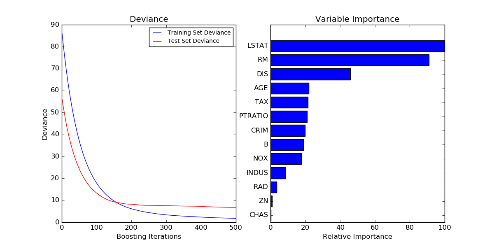

.. _example_ensemble_plot_gradient_boosting_regression.py:

============================
Gradient Boosting regression
============================

Demonstrate Gradient Boosting on the Boston housing dataset.

This example fits a Gradient Boosting model with least squares loss and
500 regression trees of depth 4.

**Script output**::

  MSE: 6.7710

**Python source code:** :download:`plot_gradient_boosting_regression.py <plot_gradient_boosting_regression.py>`

.. literalinclude:: plot_gradient_boosting_regression.py
    :lines: 11-

**Total running time of the example:**  0.53 seconds
( 0 minutes  0.53 seconds)
    