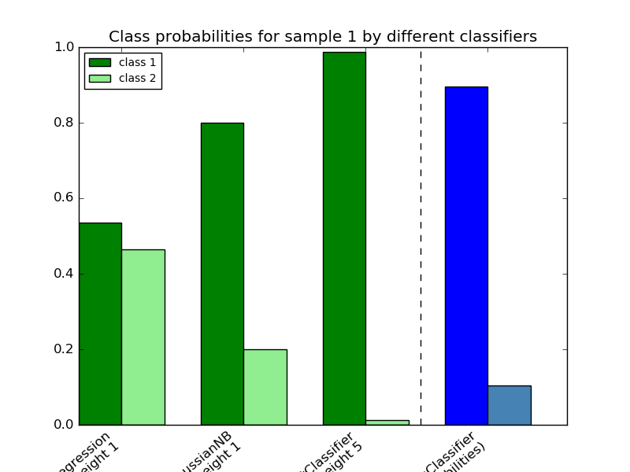

.. _example_ensemble_plot_voting_probas.py:

===========================================================
Plot class probabilities calculated by the VotingClassifier
===========================================================

Plot the class probabilities of the first sample in a toy dataset
predicted by three different classifiers and averaged by the
`VotingClassifier`.

First, three examplary classifiers are initialized (`LogisticRegression`,
`GaussianNB`, and `RandomForestClassifier`) and used to initialize a
soft-voting `VotingClassifier` with weights `[1, 1, 5]`, which means that
the predicted probabilities of the `RandomForestClassifier` count 5 times
as much as the weights of the other classifiers when the averaged probability
is calculated.

To visualize the probability weighting, we fit each classifier on the training
set and plot the predicted class probabilities for the first sample in this
example dataset.

**Python source code:** :download:`plot_voting_probas.py <plot_voting_probas.py>`

.. literalinclude:: plot_voting_probas.py
    :lines: 22-

**Total running time of the example:**  0.11 seconds
( 0 minutes  0.11 seconds)
    