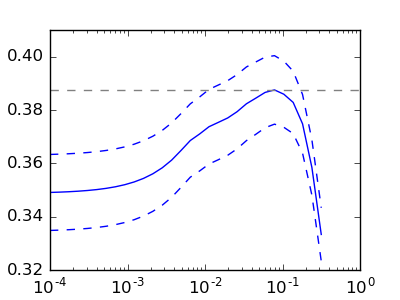

.. _example_exercises_plot_cv_diabetes.py:

===============================================
Cross-validation on diabetes Dataset Exercise
===============================================

A tutorial exercise which uses cross-validation with linear models.

This exercise is used in the :ref:`cv_estimators_tut` part of the
:ref:`model_selection_tut` section of the :ref:`stat_learn_tut_index`.

**Script output**::

  Answer to the bonus question: how much can you trust the selection of alpha?
  
  Alpha parameters maximising the generalization score on different
  subsets of the data:
  [fold 0] alpha: 0.10405, score: 0.53573
  [fold 1] alpha: 0.05968, score: 0.16278
  [fold 2] alpha: 0.10405, score: 0.44437
  
  Answer: Not very much since we obtained different alphas for different
  subsets of the data and moreover, the scores for these alphas differ
  quite substantially.

**Python source code:** :download:`plot_cv_diabetes.py <plot_cv_diabetes.py>`

.. literalinclude:: plot_cv_diabetes.py
    :lines: 11-

**Total running time of the example:**  0.60 seconds
( 0 minutes  0.60 seconds)
    