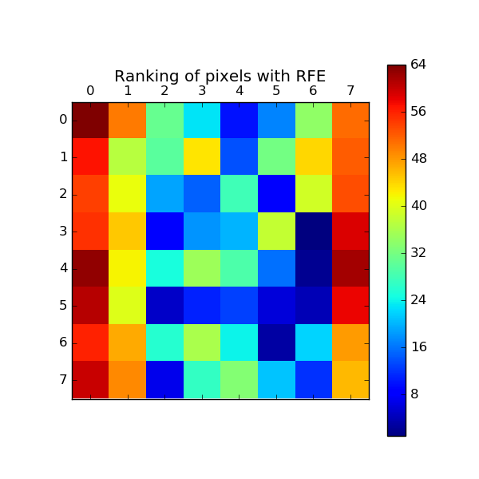

.. _example_feature_selection_plot_rfe_digits.py:

=============================
Recursive feature elimination
=============================

A recursive feature elimination example showing the relevance of pixels in
a digit classification task.

.. note::

    See also :ref:`example_feature_selection_plot_rfe_with_cross_validation.py`

**Python source code:** :download:`plot_rfe_digits.py <plot_rfe_digits.py>`

.. literalinclude:: plot_rfe_digits.py
    :lines: 14-

**Total running time of the example:**  5.10 seconds
( 0 minutes  5.10 seconds)
    