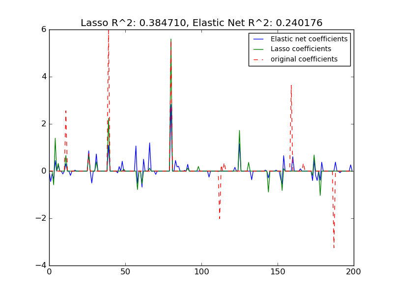

.. _example_linear_model_plot_lasso_and_elasticnet.py:

========================================
Lasso and Elastic Net for Sparse Signals
========================================

Estimates Lasso and Elastic-Net regression models on a manually generated
sparse signal corrupted with an additive noise. Estimated coefficients are
compared with the ground-truth.

**Script output**::

  Lasso(alpha=0.1, copy_X=True, fit_intercept=True, max_iter=1000,
     normalize=False, positive=False, precompute=False, random_state=None,
     selection='cyclic', tol=0.0001, warm_start=False)
  r^2 on test data : 0.384710
  ElasticNet(alpha=0.1, copy_X=True, fit_intercept=True, l1_ratio=0.7,
        max_iter=1000, normalize=False, positive=False, precompute=False,
        random_state=None, selection='cyclic', tol=0.0001, warm_start=False)
  r^2 on test data : 0.240176

**Python source code:** :download:`plot_lasso_and_elasticnet.py <plot_lasso_and_elasticnet.py>`

.. literalinclude:: plot_lasso_and_elasticnet.py
    :lines: 11-

**Total running time of the example:**  0.06 seconds
( 0 minutes  0.06 seconds)
    