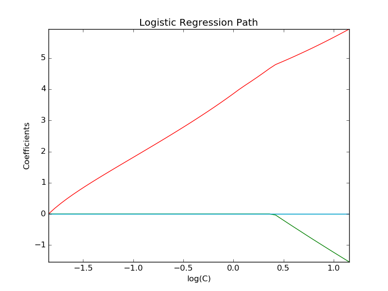

.. _example_linear_model_plot_logistic_path.py:

=================================
Path with L1- Logistic Regression
=================================

Computes path on IRIS dataset.

**Script output**::

  Computing regularization path ...
  This took  0:00:00.045660

**Python source code:** :download:`plot_logistic_path.py <plot_logistic_path.py>`

.. literalinclude:: plot_logistic_path.py
    :lines: 10-

**Total running time of the example:**  0.10 seconds
( 0 minutes  0.10 seconds)
    