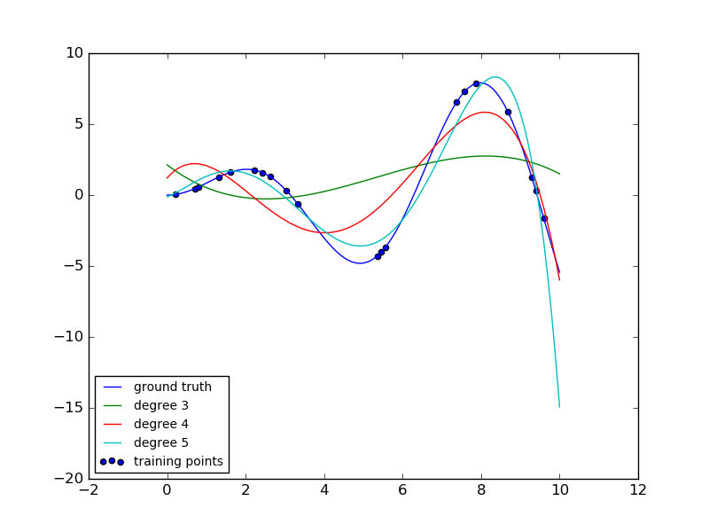

.. _example_linear_model_plot_polynomial_interpolation.py:

========================
Polynomial interpolation
========================

This example demonstrates how to approximate a function with a polynomial of
degree n_degree by using ridge regression. Concretely, from n_samples 1d
points, it suffices to build the Vandermonde matrix, which is n_samples x
n_degree+1 and has the following form:

[[1, x_1, x_1 ** 2, x_1 ** 3, ...],
 [1, x_2, x_2 ** 2, x_2 ** 3, ...],
 ...]

Intuitively, this matrix can be interpreted as a matrix of pseudo features (the
points raised to some power). The matrix is akin to (but different from) the
matrix induced by a polynomial kernel.

This example shows that you can do non-linear regression with a linear model,
using a pipeline to add non-linear features. Kernel methods extend this idea
and can induce very high (even infinite) dimensional feature spaces.

**Python source code:** :download:`plot_polynomial_interpolation.py <plot_polynomial_interpolation.py>`

.. literalinclude:: plot_polynomial_interpolation.py
    :lines: 24-

**Total running time of the example:**  0.07 seconds
( 0 minutes  0.07 seconds)
    