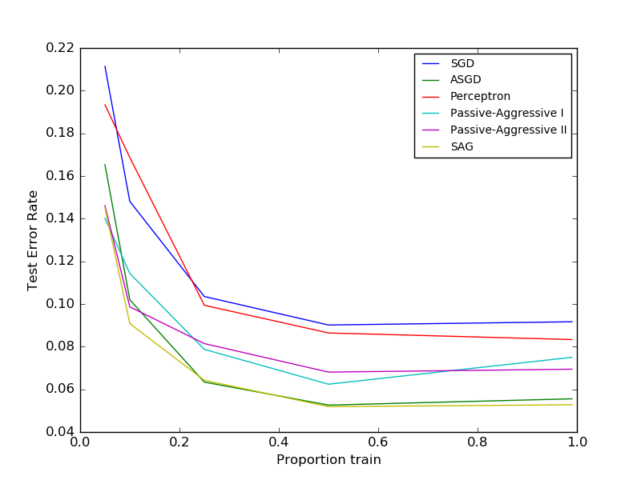

.. _example_linear_model_plot_sgd_comparison.py:

==================================
Comparing various online solvers
==================================

An example showing how different online solvers perform
on the hand-written digits dataset.

**Script output**::

  training SGD
  training ASGD
  training Perceptron
  training Passive-Aggressive I
  training Passive-Aggressive II
  training SAG

**Python source code:** :download:`plot_sgd_comparison.py <plot_sgd_comparison.py>`

.. literalinclude:: plot_sgd_comparison.py
    :lines: 10-

**Total running time of the example:**  6.59 seconds
( 0 minutes  6.59 seconds)
    