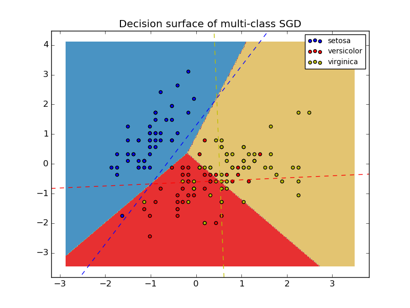

.. _example_linear_model_plot_sgd_iris.py:

========================================
Plot multi-class SGD on the iris dataset
========================================

Plot decision surface of multi-class SGD on iris dataset.
The hyperplanes corresponding to the three one-versus-all (OVA) classifiers
are represented by the dashed lines.

**Python source code:** :download:`plot_sgd_iris.py <plot_sgd_iris.py>`

.. literalinclude:: plot_sgd_iris.py
    :lines: 11-

**Total running time of the example:**  0.09 seconds
( 0 minutes  0.09 seconds)
    