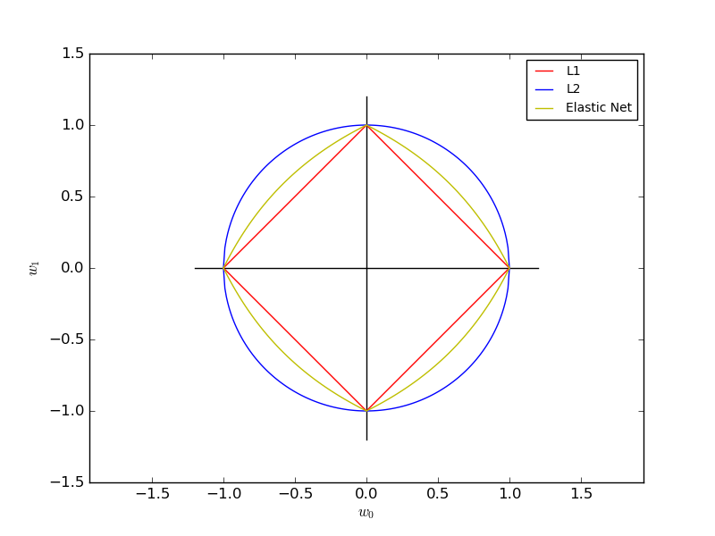

.. _example_linear_model_plot_sgd_penalties.py:

==============
SGD: Penalties
==============

Plot the contours of the three penalties.

All of the above are supported by
:class:`sklearn.linear_model.stochastic_gradient`.

**Python source code:** :download:`plot_sgd_penalties.py <plot_sgd_penalties.py>`

.. literalinclude:: plot_sgd_penalties.py
    :lines: 12-

**Total running time of the example:**  0.08 seconds
( 0 minutes  0.08 seconds)
    