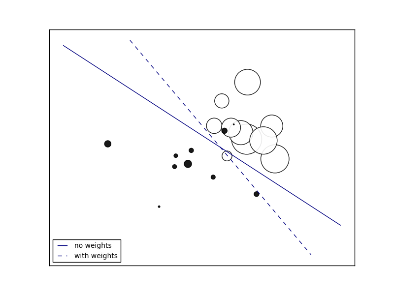

.. _example_linear_model_plot_sgd_weighted_samples.py:

=====================
SGD: Weighted samples
=====================

Plot decision function of a weighted dataset, where the size of points
is proportional to its weight.

**Python source code:** :download:`plot_sgd_weighted_samples.py <plot_sgd_weighted_samples.py>`

.. literalinclude:: plot_sgd_weighted_samples.py
    :lines: 9-

**Total running time of the example:**  0.10 seconds
( 0 minutes  0.10 seconds)
    