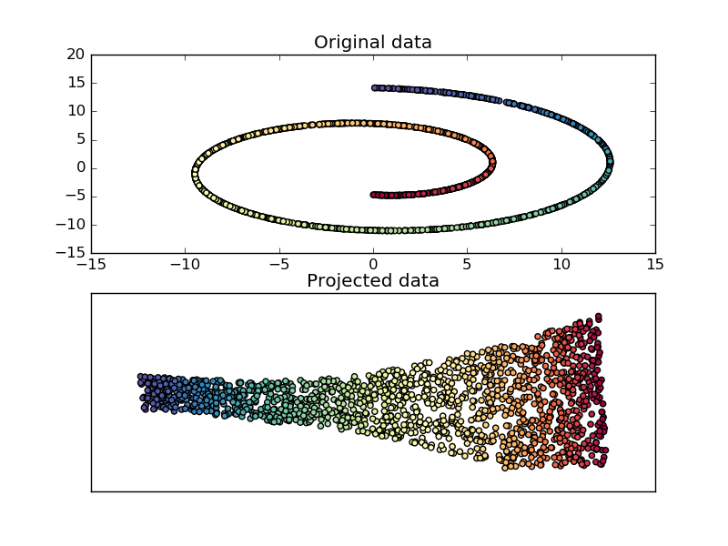

.. _example_manifold_plot_swissroll.py:

===================================
Swiss Roll reduction with LLE
===================================

An illustration of Swiss Roll reduction
with locally linear embedding

**Script output**::

  Computing LLE embedding
  Done. Reconstruction error: 9.98005e-08

**Python source code:** :download:`plot_swissroll.py <plot_swissroll.py>`

.. literalinclude:: plot_swissroll.py
    :lines: 9-

**Total running time of the example:**  0.30 seconds
( 0 minutes  0.30 seconds)
    