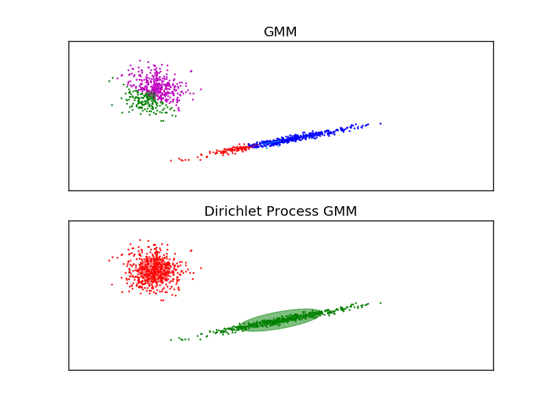

.. _example_mixture_plot_gmm.py:

=================================
Gaussian Mixture Model Ellipsoids
=================================

Plot the confidence ellipsoids of a mixture of two Gaussians with EM
and variational Dirichlet process.

Both models have access to five components with which to fit the
data. Note that the EM model will necessarily use all five components
while the DP model will effectively only use as many as are needed for
a good fit. This is a property of the Dirichlet Process prior. Here we
can see that the EM model splits some components arbitrarily, because it
is trying to fit too many components, while the Dirichlet Process model
adapts it number of state automatically.

This example doesn't show it, as we're in a low-dimensional space, but
another advantage of the Dirichlet process model is that it can fit
full covariance matrices effectively even when there are less examples
per cluster than there are dimensions in the data, due to
regularization properties of the inference algorithm.

**Python source code:** :download:`plot_gmm.py <plot_gmm.py>`

.. literalinclude:: plot_gmm.py
    :lines: 23-

**Total running time of the example:**  0.26 seconds
( 0 minutes  0.26 seconds)
    