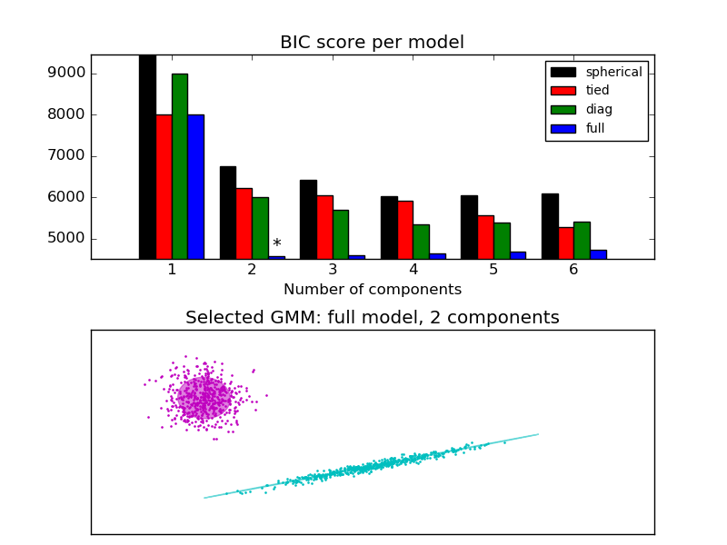

.. _example_mixture_plot_gmm_selection.py:

=================================
Gaussian Mixture Model Selection
=================================

This example shows that model selection can be performed with
Gaussian Mixture Models using information-theoretic criteria (BIC).
Model selection concerns both the covariance type
and the number of components in the model.
In that case, AIC also provides the right result (not shown to save time),
but BIC is better suited if the problem is to identify the right model.
Unlike Bayesian procedures, such inferences are prior-free.

In that case, the model with 2 components and full covariance
(which corresponds to the true generative model) is selected.

**Python source code:** :download:`plot_gmm_selection.py <plot_gmm_selection.py>`

.. literalinclude:: plot_gmm_selection.py
    :lines: 17-

**Total running time of the example:**  1.01 seconds
( 0 minutes  1.01 seconds)
    