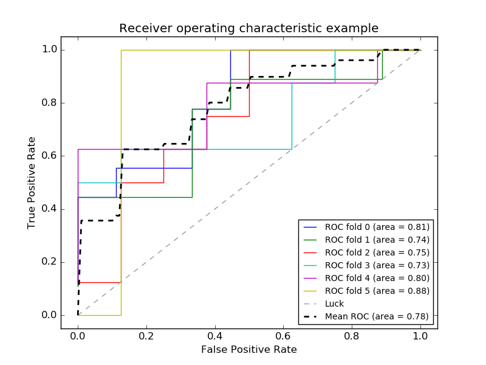

.. _example_model_selection_plot_roc_crossval.py:

=============================================================
Receiver Operating Characteristic (ROC) with cross validation
=============================================================

Example of Receiver Operating Characteristic (ROC) metric to evaluate
classifier output quality using cross-validation.

ROC curves typically feature true positive rate on the Y axis, and false
positive rate on the X axis. This means that the top left corner of the plot is
the "ideal" point - a false positive rate of zero, and a true positive rate of
one. This is not very realistic, but it does mean that a larger area under the
curve (AUC) is usually better.

The "steepness" of ROC curves is also important, since it is ideal to maximize
the true positive rate while minimizing the false positive rate.

This example shows the ROC response of different datasets, created from K-fold
cross-validation. Taking all of these curves, it is possible to calculate the
mean area under curve, and see the variance of the curve when the
training set is split into different subsets. This roughly shows how the
classifier output is affected by changes in the training data, and how
different the splits generated by K-fold cross-validation are from one another.

.. note::

    See also :func:`sklearn.metrics.auc_score`,
             :func:`sklearn.cross_validation.cross_val_score`,
             :ref:`example_model_selection_plot_roc.py`,

**Python source code:** :download:`plot_roc_crossval.py <plot_roc_crossval.py>`

.. literalinclude:: plot_roc_crossval.py
    :lines: 32-

**Total running time of the example:**  0.27 seconds
( 0 minutes  0.27 seconds)
    