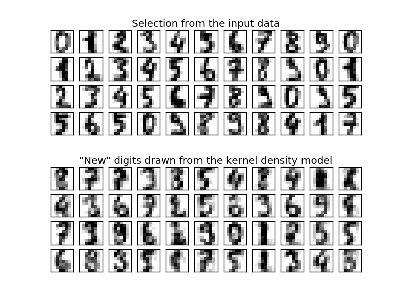

.. _example_neighbors_plot_digits_kde_sampling.py:

=========================
Kernel Density Estimation
=========================

This example shows how kernel density estimation (KDE), a powerful
non-parametric density estimation technique, can be used to learn
a generative model for a dataset.  With this generative model in place,
new samples can be drawn.  These new samples reflect the underlying model
of the data.

**Script output**::

  best bandwidth: 3.79269019073

**Python source code:** :download:`plot_digits_kde_sampling.py <plot_digits_kde_sampling.py>`

.. literalinclude:: plot_digits_kde_sampling.py
    :lines: 12-

**Total running time of the example:**  8.73 seconds
( 0 minutes  8.73 seconds)
    