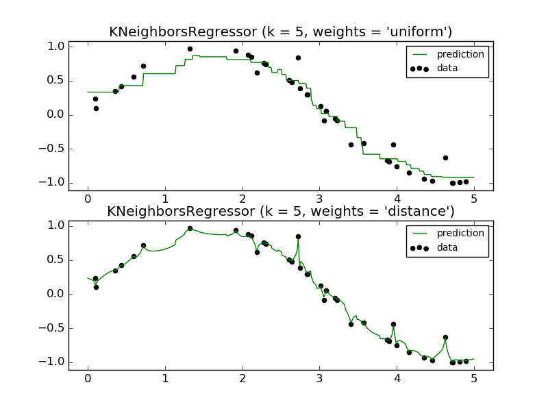

.. _example_neighbors_plot_regression.py:

============================
Nearest Neighbors regression
============================

Demonstrate the resolution of a regression problem
using a k-Nearest Neighbor and the interpolation of the
target using both barycenter and constant weights.

**Python source code:** :download:`plot_regression.py <plot_regression.py>`

.. literalinclude:: plot_regression.py
    :lines: 11-

**Total running time of the example:**  0.11 seconds
( 0 minutes  0.11 seconds)
    