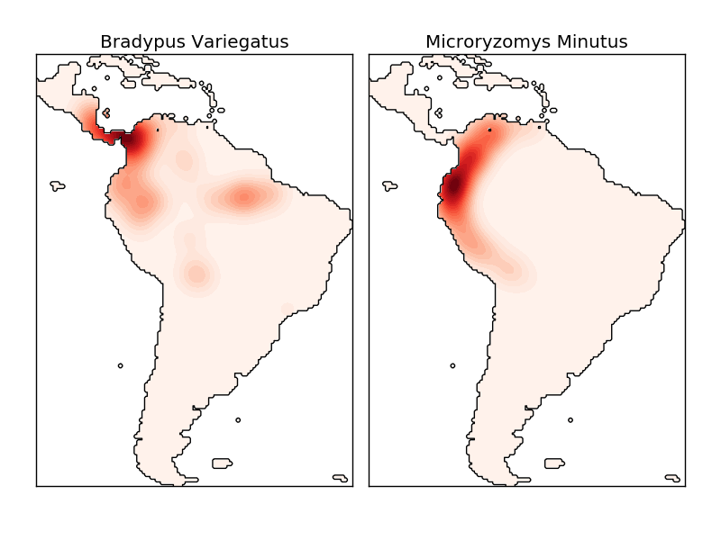

.. _example_neighbors_plot_species_kde.py:

================================================
Kernel Density Estimate of Species Distributions
================================================
This shows an example of a neighbors-based query (in particular a kernel
density estimate) on geospatial data, using a Ball Tree built upon the
Haversine distance metric -- i.e. distances over points in latitude/longitude.
The dataset is provided by Phillips et. al. (2006).
If available, the example uses
`basemap <http://matplotlib.sourceforge.net/basemap/doc/html/>`_
to plot the coast lines and national boundaries of South America.

This example does not perform any learning over the data
(see :ref:`example_applications_plot_species_distribution_modeling.py` for
an example of classification based on the attributes in this dataset).  It
simply shows the kernel density estimate of observed data points in
geospatial coordinates.

The two species are:

 - `"Bradypus variegatus"
   <http://www.iucnredlist.org/apps/redlist/details/3038/0>`_ ,
   the Brown-throated Sloth.

 - `"Microryzomys minutus"
   <http://www.iucnredlist.org/apps/redlist/details/13408/0>`_ ,
   also known as the Forest Small Rice Rat, a rodent that lives in Peru,
   Colombia, Ecuador, Peru, and Venezuela.

References
----------

 * `"Maximum entropy modeling of species geographic distributions"
   <http://www.cs.princeton.edu/~schapire/papers/ecolmod.pdf>`_
   S. J. Phillips, R. P. Anderson, R. E. Schapire - Ecological Modelling,
   190:231-259, 2006.

**Script output**::

  - computing KDE in spherical coordinates
   - plot coastlines from coverage
   - computing KDE in spherical coordinates
   - plot coastlines from coverage

**Python source code:** :download:`plot_species_kde.py <plot_species_kde.py>`

.. literalinclude:: plot_species_kde.py
    :lines: 38-

**Total running time of the example:**  10.39 seconds
( 0 minutes  10.39 seconds)
    