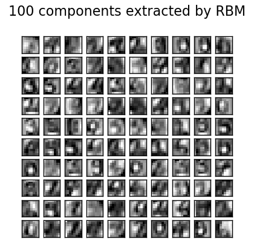

.. _example_neural_networks_plot_rbm_logistic_classification.py:

==============================================================
Restricted Boltzmann Machine features for digit classification
==============================================================

For greyscale image data where pixel values can be interpreted as degrees of
blackness on a white background, like handwritten digit recognition, the
Bernoulli Restricted Boltzmann machine model (:class:`BernoulliRBM
<sklearn.neural_network.BernoulliRBM>`) can perform effective non-linear
feature extraction.

In order to learn good latent representations from a small dataset, we
artificially generate more labeled data by perturbing the training data with
linear shifts of 1 pixel in each direction.

This example shows how to build a classification pipeline with a BernoulliRBM
feature extractor and a :class:`LogisticRegression
<sklearn.linear_model.LogisticRegression>` classifier. The hyperparameters
of the entire model (learning rate, hidden layer size, regularization)
were optimized by grid search, but the search is not reproduced here because
of runtime constraints.

Logistic regression on raw pixel values is presented for comparison. The
example shows that the features extracted by the BernoulliRBM help improve the
classification accuracy.

**Script output**::

  [BernoulliRBM] Iteration 1, pseudo-likelihood = -25.39, time = 0.39s
  [BernoulliRBM] Iteration 2, pseudo-likelihood = -23.77, time = 0.87s
  [BernoulliRBM] Iteration 3, pseudo-likelihood = -22.94, time = 0.48s
  [BernoulliRBM] Iteration 4, pseudo-likelihood = -21.91, time = 0.45s
  [BernoulliRBM] Iteration 5, pseudo-likelihood = -21.69, time = 0.44s
  [BernoulliRBM] Iteration 6, pseudo-likelihood = -21.06, time = 0.66s
  [BernoulliRBM] Iteration 7, pseudo-likelihood = -20.89, time = 0.46s
  [BernoulliRBM] Iteration 8, pseudo-likelihood = -20.64, time = 0.45s
  [BernoulliRBM] Iteration 9, pseudo-likelihood = -20.36, time = 0.44s
  [BernoulliRBM] Iteration 10, pseudo-likelihood = -20.09, time = 0.59s
  [BernoulliRBM] Iteration 11, pseudo-likelihood = -20.08, time = 0.46s
  [BernoulliRBM] Iteration 12, pseudo-likelihood = -19.82, time = 0.45s
  [BernoulliRBM] Iteration 13, pseudo-likelihood = -19.64, time = 0.45s
  [BernoulliRBM] Iteration 14, pseudo-likelihood = -19.61, time = 0.48s
  [BernoulliRBM] Iteration 15, pseudo-likelihood = -19.57, time = 0.47s
  [BernoulliRBM] Iteration 16, pseudo-likelihood = -19.41, time = 0.46s
  [BernoulliRBM] Iteration 17, pseudo-likelihood = -19.30, time = 0.43s
  [BernoulliRBM] Iteration 18, pseudo-likelihood = -19.25, time = 0.44s
  [BernoulliRBM] Iteration 19, pseudo-likelihood = -19.27, time = 0.44s
  [BernoulliRBM] Iteration 20, pseudo-likelihood = -19.01, time = 0.44s
  
  Logistic regression using RBM features:
               precision    recall  f1-score   support
  
            0       0.99      0.99      0.99       174
            1       0.92      0.95      0.93       184
            2       0.95      0.98      0.97       166
            3       0.97      0.91      0.94       194
            4       0.97      0.95      0.96       186
            5       0.93      0.93      0.93       181
            6       0.98      0.97      0.97       207
            7       0.95      1.00      0.97       154
            8       0.90      0.88      0.89       182
            9       0.91      0.93      0.92       169
  
  avg / total       0.95      0.95      0.95      1797
  
  
  Logistic regression using raw pixel features:
               precision    recall  f1-score   support
  
            0       0.85      0.94      0.89       174
            1       0.57      0.55      0.56       184
            2       0.72      0.85      0.78       166
            3       0.76      0.74      0.75       194
            4       0.85      0.82      0.84       186
            5       0.74      0.75      0.75       181
            6       0.93      0.88      0.91       207
            7       0.86      0.90      0.88       154
            8       0.68      0.55      0.61       182
            9       0.71      0.74      0.72       169
  
  avg / total       0.77      0.77      0.77      1797

**Python source code:** :download:`plot_rbm_logistic_classification.py <plot_rbm_logistic_classification.py>`

.. literalinclude:: plot_rbm_logistic_classification.py
    :lines: 27-

**Total running time of the example:**  45.08 seconds
( 0 minutes  45.08 seconds)
    