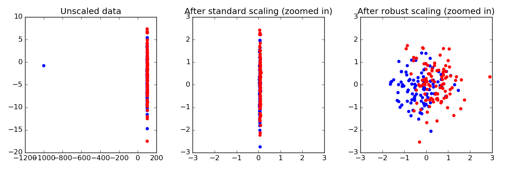

.. _example_preprocessing_plot_robust_scaling.py:

=========================================================
Robust Scaling on Toy Data
=========================================================

Making sure that each Feature has approximately the same scale can be a
crucial preprocessing step. However, when data contains outliers,
:class:`StandardScaler <sklearn.preprocessing.StandardScaler>` can often
be mislead. In such cases, it is better to use a scaler that is robust
against outliers.

Here, we demonstrate this on a toy dataset, where one single datapoint
is a large outlier.

**Script output**::

  Testset accuracy using standard scaler: 0.545
  Testset accuracy using robust scaler:   0.700

**Python source code:** :download:`plot_robust_scaling.py <plot_robust_scaling.py>`

.. literalinclude:: plot_robust_scaling.py
    :lines: 18-

**Total running time of the example:**  0.25 seconds
( 0 minutes  0.25 seconds)
    