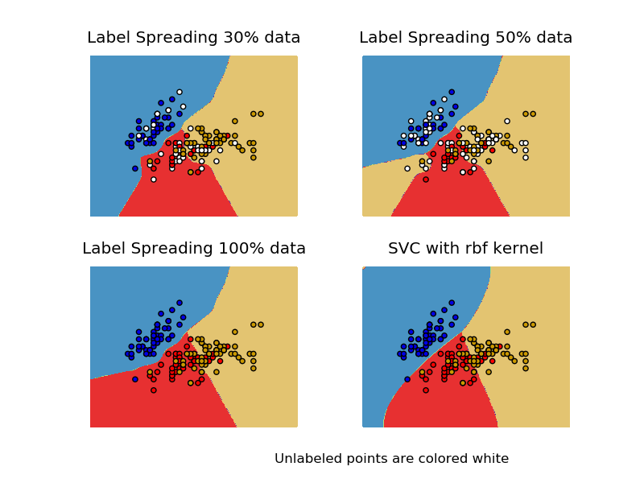

.. _example_semi_supervised_plot_label_propagation_versus_svm_iris.py:

=====================================================================
Decision boundary of label propagation versus SVM on the Iris dataset
=====================================================================

Comparison for decision boundary generated on iris dataset
between Label Propagation and SVM.

This demonstrates Label Propagation learning a good boundary
even with a small amount of labeled data.

**Python source code:** :download:`plot_label_propagation_versus_svm_iris.py <plot_label_propagation_versus_svm_iris.py>`

.. literalinclude:: plot_label_propagation_versus_svm_iris.py
    :lines: 13-

**Total running time of the example:**  1.53 seconds
( 0 minutes  1.53 seconds)
    