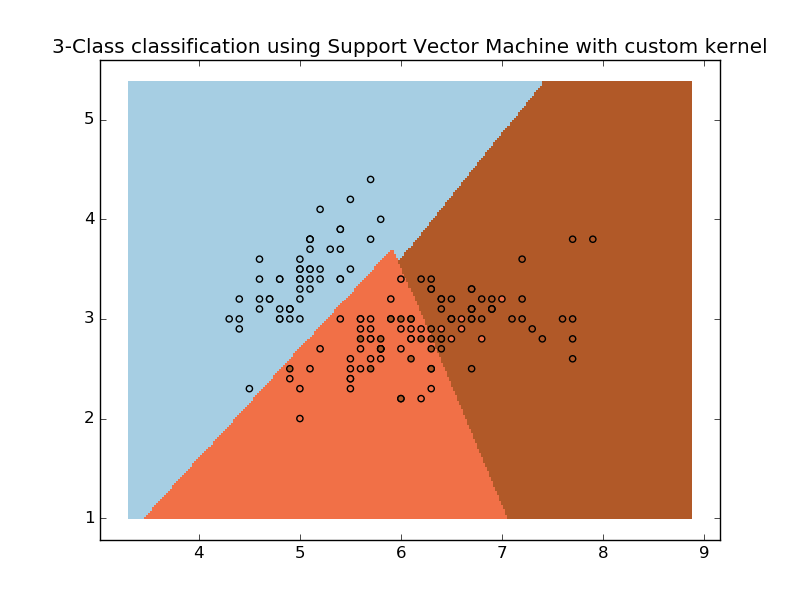

.. _example_svm_plot_custom_kernel.py:

======================
SVM with custom kernel
======================

Simple usage of Support Vector Machines to classify a sample. It will
plot the decision surface and the support vectors.

**Python source code:** :download:`plot_custom_kernel.py <plot_custom_kernel.py>`

.. literalinclude:: plot_custom_kernel.py
    :lines: 10-

**Total running time of the example:**  0.13 seconds
( 0 minutes  0.13 seconds)
    