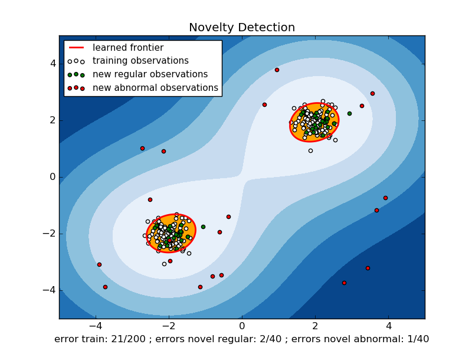

.. _example_svm_plot_oneclass.py:

==========================================
One-class SVM with non-linear kernel (RBF)
==========================================

An example using a one-class SVM for novelty detection.

:ref:`One-class SVM <svm_outlier_detection>` is an unsupervised
algorithm that learns a decision function for novelty detection:
classifying new data as similar or different to the training set.

**Python source code:** :download:`plot_oneclass.py <plot_oneclass.py>`

.. literalinclude:: plot_oneclass.py
    :lines: 12-

**Total running time of the example:**  0.31 seconds
( 0 minutes  0.31 seconds)
    