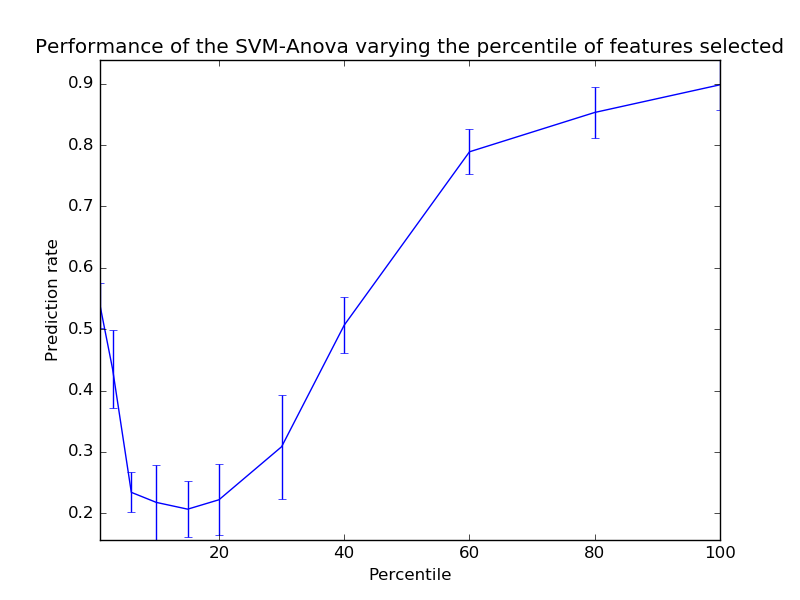

.. _example_svm_plot_svm_anova.py:

=================================================
SVM-Anova: SVM with univariate feature selection
=================================================

This example shows how to perform univariate feature before running a SVC
(support vector classifier) to improve the classification scores.

**Python source code:** :download:`plot_svm_anova.py <plot_svm_anova.py>`

.. literalinclude:: plot_svm_anova.py
    :lines: 9-

**Total running time of the example:**  0.58 seconds
( 0 minutes  0.58 seconds)
    