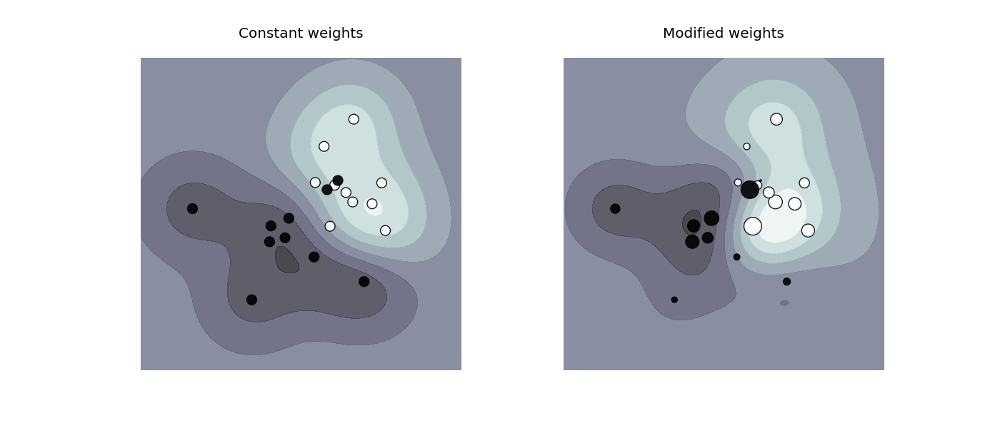

.. _example_svm_plot_weighted_samples.py:

=====================
SVM: Weighted samples
=====================

Plot decision function of a weighted dataset, where the size of points
is proportional to its weight.

The sample weighting rescales the C parameter, which means that the classifier
puts more emphasis on getting these points right. The effect might often be
subtle.
To emphasize the effect here, we particularly weight outliers, making the
deformation of the decision boundary very visible.

**Python source code:** :download:`plot_weighted_samples.py <plot_weighted_samples.py>`

.. literalinclude:: plot_weighted_samples.py
    :lines: 15-

**Total running time of the example:**  0.52 seconds
( 0 minutes  0.52 seconds)
    