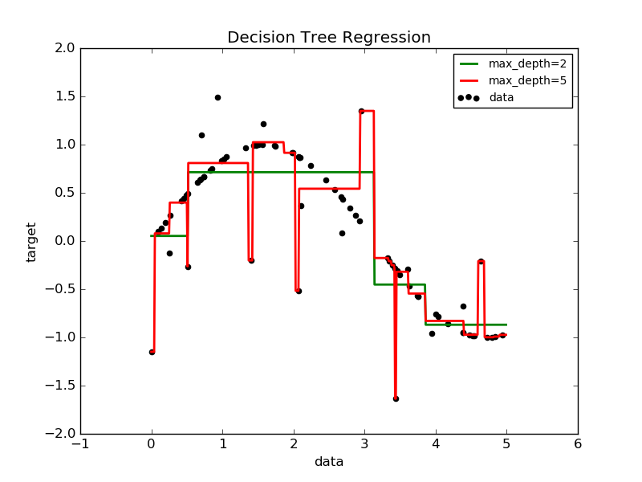

.. _example_tree_plot_tree_regression.py:

===================================================================
Decision Tree Regression
===================================================================

A 1D regression with decision tree.

The :ref:`decision trees <tree>` is
used to fit a sine curve with addition noisy observation. As a result, it
learns local linear regressions approximating the sine curve.

We can see that if the maximum depth of the tree (controlled by the
`max_depth` parameter) is set too high, the decision trees learn too fine
details of the training data and learn from the noise, i.e. they overfit.

**Python source code:** :download:`plot_tree_regression.py <plot_tree_regression.py>`

.. literalinclude:: plot_tree_regression.py
    :lines: 16-

**Total running time of the example:**  0.06 seconds
( 0 minutes  0.06 seconds)
    