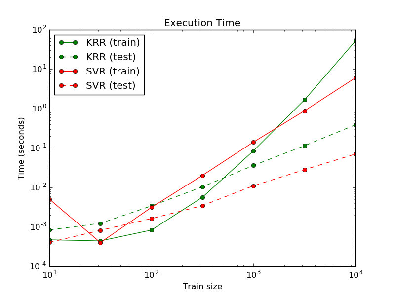

.. _kernel_ridge:

=================================
核岭回归(Kernel ridge regression)
=================================

.. currentmodule:: sklearn.kernel_ridge

核岭回归(KRR) [M2012]_ 把 :ref:`岭回归` (L2正则化的线性最小二乘) 与核方法相结合。因此，它可以在一个由核与数据决定的空间内进行线性函数学习。对于非线性核而言，它就相当于原空间中的非线性函数。

通过 :class:`KernelRidge` 学习得到的模型形式和支持向量回归 (:class:`SVR`)相同。不过两者使用了不同的损失函数：核岭回归采用了平方误差损失函数，而支持向量回归却采用了 :math:`\epsilon` -不敏感损失函数, 两者都结合了L2正则化。与 :class:`SVR` 相比, 对 :class:`KernelRidge` 的拟合工作可以在闭式(closed-form)中完成，而且在中等规模的数据集中有着更快的速度。在另一个方面，核岭回归对非稀疏模型的学习慢于支持向量回归，因为后者在预计时间内对 :math:`\epsilon > 0` 的稀疏模型进行学习。

下图对比了 :class:`KernelRidge` 和 :class:`SVR` 在人工数据集中的表现，该数据集由正弦目标函数以及对每15个数据点所加的噪声组成。 :class:`KernelRidge` 和 :class:`SVR` 的模型已经被画出，其中复杂度/正则化的比值以及RBF核的带宽参数都通过网格搜索法进行了优化。虽然两个学习函数非常接近，但是 :class:`KernelRidge` 的拟合比 :class:`SVR` 的拟合大约快了7倍（两者都使用网格搜索法）。不过SVR预测100000个目标值的速度比KRR快了3倍，因为它学习稀疏模型只用了100个作为支持向量的数据点中的大约1/3。

.. figure:: ../auto_examples/images/plot_kernel_ridge_regression_001.png
   :target: ../auto_examples/plot_kernel_ridge_regression.html
   :align: center

下图比较了 :class:`KernelRidge` 和 :class:`SVR` 在不同规模数据集中拟合与预测的用时。在中等规模数据集（样本小于1000）中，拟合 :class:`KernelRidge` 模型比拟合 :class:`SVR` 模型大约快了3倍。然而对于大规模数据集， :class:`SVR`则 表现的更好。在预测用时的比较中，由于模型稀疏解的缘故， :class:`SVR` 在任何规模的训练集中都快于 :class:`KernelRidge` 。注意：稀疏度和预测时间取决于 :class:`SVR` 的参数 :math:`\epsilon` 和 :math:`C`; 参数 :math:`\epsilon = 0` 相当于一个稠密模型。

.. topic:: 参考文献:

    .. [M2012] "Machine Learning: A Probabilistic Perspective"
      Murphy, K. P. - chapter 14.4.3, pp. 492-493, The MIT Press, 2012

