.. _linear_model:

=======================================
Generalized Linear Models 广义线性模型
=======================================

.. currentmodule:: sklearn.linear_model

以下是回归相关的一系列方法，目标值y是输入变量x的线性组合。用数学表达: `\hat{y}` 是预测值

.. math::    \hat{y}(w, x) = w_0 + w_1 x_1 + ... + w_p x_p

在这个模块中,我们定义向量 :math:`w = (w_1,...,w_p)` 为 ``coef_`` ,math:`w_0` 表示为 ``intercept_``
Across the module, we designate the vector :math:`w = (w_1,
..., w_p)` as ``coef_`` and :math:`w_0` as ``intercept_``.

使用广义线性模型来处理分类问题(classification)请参考
:ref:`Logistic_regression`.

.. _ordinary_least_squares:

普通最小二乘法
=====================

:class:`LinearRegression` 用系数：math: `w = (w_1,...,w_p)` 来拟合一个线性模型,
使得数据集实际观测数据和预测数据（估计值）之间残差平方和最小。数学形式可表达为:

.. math:: \underset{w}{min\,} {|| X w - y||_2}^2

.. figure:: ../auto_examples/linear_model/images/plot_ols_001.png
   :target: ../auto_examples/linear_model/plot_ols.html
   :align: center
   :scale: 50%

:class:`LinearRegression` 模型会调用 ``fit`` 方法来拟合X,y(X为输入，y为输出).并且会把拟合的线性模型的系数 :math:`w` 存储到成员变量 ``coef_`` 中

    >>> from sklearn import linear_model
    >>> clf = linear_model.LinearRegression()
    >>> clf.fit ([[0, 0], [1, 1], [2, 2]], [0, 1, 2])
    LinearRegression(copy_X=True, fit_intercept=True, n_jobs=1, normalize=False)
    >>> clf.coef_
    array([ 0.5,  0.5])

然而，对于普通最小二乘问题，其系数估计依赖模型各项相互独立。当各项是相关的，设计矩阵(Design Matrix) :math:`x` 的各列近似线性相关，
那么，设计矩阵会趋向于奇异矩阵，这会导致最小二乘估计对于随机误差非常敏感，会产生很大的方差。这种 *多重共线性(multicollinearity)* 
的情况可能真的会出现，比如未经实验设计收集的数据.

.. topic:: Examples:

   * :ref:`example_linear_model_plot_ols.py`

普通最小二乘复杂度
------------------------------------------------------

这种方法通过对矩阵 X 奇异值分解（SVD）的方式来计算最小二乘的解。如果 X 是一个(n, p)大小的矩阵,那么代价为 :math:`O(n p^2)`,假设 :math:`n \geq p`.

.. _ridge_regression:

Ridge Regression 岭回归
==========================

:class:`Ridge` 岭回归通过对回归稀疏增加罚项来解决 :ref:`ordinary_least_squares` 的一些问题.岭回归系数通过最小化带罚项的残差平方和

.. math::

   \underset{w}{min\,} {{|| X w - y||_2}^2 + \alpha {||w||_2}^2}

上述公式中,:math:`\alpha \geq 0` 是控制模型复杂度的因子(可看做收缩率的大小) : :math:`\alpha` 越大，收缩率越大，那么系数对于共线性的鲁棒性更强

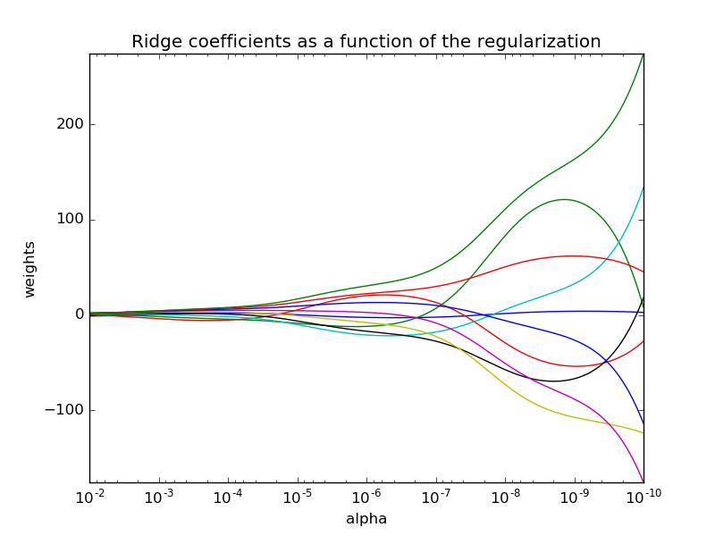

和其他线性模型一样，:class:`Ridge` 调用 ``fit`` 方法，参数为X,y,并且将线性模型拟合的系数 :math:`w` 存到成员变量 ``coef_`` 中。::

    >>> from sklearn import linear_model
    >>> clf = linear_model.Ridge (alpha = .5)
    >>> clf.fit ([[0, 0], [0, 0], [1, 1]], [0, .1, 1]) # doctest: +NORMALIZE_WHITESPACE
    Ridge(alpha=0.5, copy_X=True, fit_intercept=True, max_iter=None,
          normalize=False, random_state=None, solver='auto', tol=0.001)
    >>> clf.coef_
    array([ 0.34545455,  0.34545455])
    >>> clf.intercept_ #doctest: +ELLIPSIS
    0.13636...

.. topic:: Examples:

   * :ref:`example_linear_model_plot_ridge_path.py`
   * :ref:`example_text_document_classification_20newsgroups.py`

岭回归复杂度
-------------------

这个方法和	:ref:`ordinary_least_squares` 复杂度一样(同阶).

.. FIXME:
.. Not completely true: OLS is solved by an SVD, while Ridge is solved by
.. the method of normal equations (Cholesky), there is a big flop difference
.. between these

设置正则化参数: 广义交叉验证
----------------------------------

:class:`RidgeCV` 实现了带缺省 :math:`\alpha` 参数的交叉验证的岭回归模型.这个对象和 GridSearchCV 除了它默认为广义交叉验证(GCV),其他工作方式一样。
下面是一种高效的交叉验证方式-留一交叉验证(leave-one-out):

    >>> from sklearn import linear_model
    >>> clf = linear_model.RidgeCV(alphas=[0.1, 1.0, 10.0])
    >>> clf.fit([[0, 0], [0, 0], [1, 1]], [0, .1, 1])       # doctest: +SKIP
    RidgeCV(alphas=[0.1, 1.0, 10.0], cv=None, fit_intercept=True, scoring=None,
        normalize=False)
    >>> clf.alpha_                                      # doctest: +SKIP
    0.1

.. topic:: References

    * "Notes on Regularized Least Squares", Rifkin & Lippert (`technical report
      <http://cbcl.mit.edu/projects/cbcl/publications/ps/MIT-CSAIL-TR-2007-025.pdf>`_,
      `course slides
      <http://www.mit.edu/~9.520/spring07/Classes/rlsslides.pdf>`_).

.. _lasso:

Lasso
=====

:class:`Lasso` 是一种估计稀疏线性模型的方法.由于它倾向具有少量参数值的情况，对于给定解决方案是相关情况下，有效的减少了变量数量。
因此，Lasso及其变种是压缩感知(压缩采样)的基础。在约束条件下，它可以回复一组非零精确的权重系数(参考
:ref:`example_applications_plot_tomography_l1_reconstruction.py`).

用数学形式表达，Lasso 包含一个使用 :math:`ell_1` 先验作为正则化因子的线性模型。其目标函数是最小化:

.. math::  \underset{w}{min\,} { \frac{1}{2n_{samples}} ||X w - y||_2 ^ 2 + \alpha ||w||_1}

lasso 解决带 :math:`\alpha ||w||_1` 罚项的最小平方和，其中 :math:`\alpha` 是一个常量，:math:`||w||_1` 是参数向量的 :math:`\ell_1`-norm

:class:`Lasso` 类实现使用了坐标下降法(一种非梯度优化算法) 来拟合系数.参考另一种实现 :ref:`least_angle_regression` ::

    >>> from sklearn import linear_model
    >>> clf = linear_model.Lasso(alpha = 0.1)
    >>> clf.fit([[0, 0], [1, 1]], [0, 1])
    Lasso(alpha=0.1, copy_X=True, fit_intercept=True, max_iter=1000,
       normalize=False, positive=False, precompute=False, random_state=None,
       selection='cyclic', tol=0.0001, warm_start=False)
    >>> clf.predict([[1, 1]])
    array([ 0.8])

函数 :func:`lasso_path` 对于lower-level任务非常有用。它能够通过搜索所有可能的路径上的值来计算系数.

.. topic:: Examples:

  * :ref:`example_linear_model_plot_lasso_and_elasticnet.py`
  * :ref:`example_applications_plot_tomography_l1_reconstruction.py`

.. note:: **Feature selection with Lasso**

      As the Lasso regression yields sparse models, it can
      thus be used to perform feature selection, as detailed in
      :ref:`l1_feature_selection`.

.. note:: **Randomized sparsity**

      For feature selection or sparse recovery, it may be interesting to
      use :ref:`randomized_l1`.

设置正则化参数
--------------------------------

``alpha`` 参数控制估计的系数的稀疏程度。

使用交叉验证
^^^^^^^^^^^^^^^^^^^^^^^

scikit-learn 暴露以下两个类 :class:`LassoCV` 和 :class:`LassoLarsCV` 可以设置 Lasso ``alpha`` 参数.
:class:`LassoCV` 基于下面解释的算法 :ref:`least_angle_regression` 

对于含有很多共线性的高维的数据集，:class:`LassoCV` 是最合适不过了。然而，:class:`LassoLarsCV` 在寻找 `alpha` 参数更相关的值时更具有优势，
并且如果样本相比于观测的数量时，通常比  :class:`LassoCV` 更快.

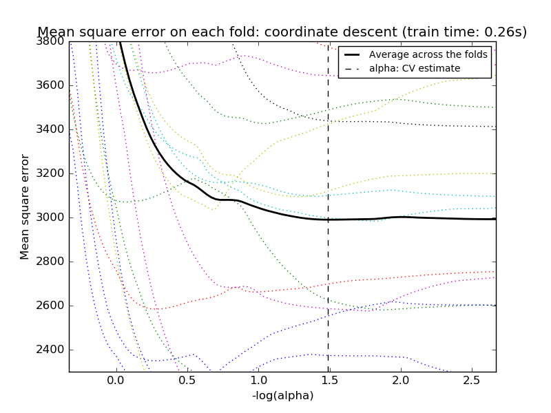

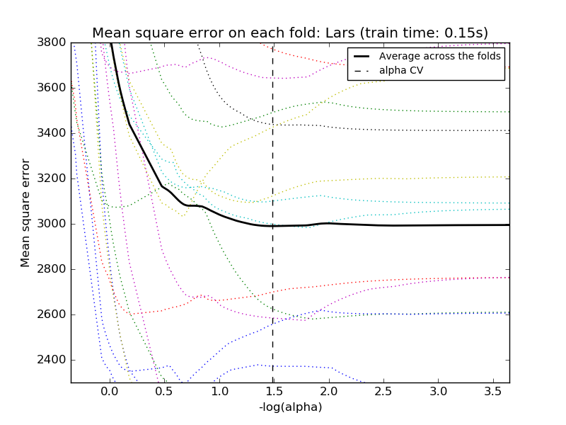

.. centered:: |lasso_cv_1| |lasso_cv_2|

基于模型选择的信息约束
^^^^^^^^^^^^^^^^^^^^^^^^^^^^^^^^^^^^^^^^^^

:class:`LassoLarsIC` 建议使用Akaike information criterion (AIC) 和 Bayes Information criterion (BIC)。
由于在计算:math:`alpha` 过程中，当使用k-折交叉验证的时候，正则化路径只计算1次而不是k+1次，所以在计算上代价非常小。
然而，这种约束需要一个合适的对于解的自由度的估计（可参考矩阵的解的自由度）,这可以从大量的样本（渐进结果）导出并且
假设模型是正确的。例如，数据实际上是有该模型产生的，但是当问题是病态条件时这种数据可能会有问题(参考病态矩阵，条件数等概念)，比如
特征维数大于样本数.（小样本问题）

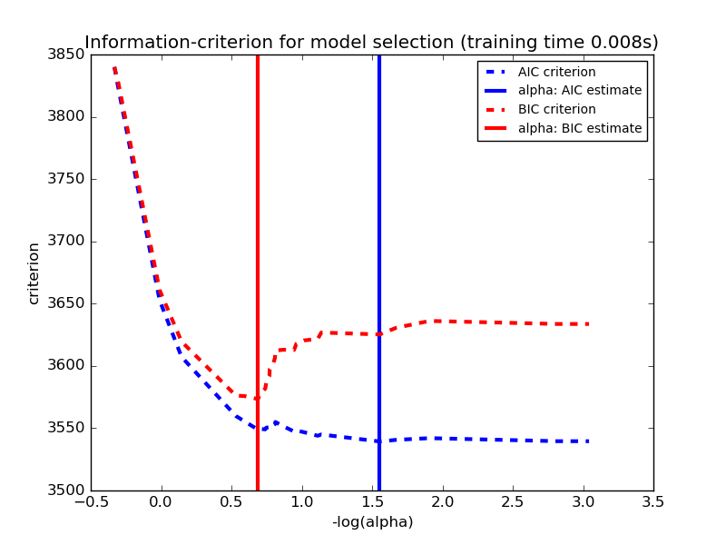

.. topic:: Examples:

  * :ref:`example_linear_model_plot_lasso_model_selection.py`

.. _elastic_net:

Elastic Net弹性网络
====================
:class:`ElasticNet` 是一种使用L1和L2先验作为正则化矩阵的线性回归模型.这种组合用于只有很少的权重非零的稀疏模型，比如:class:`Lasso`,
但是又能保持:class:`Ridge` 的正则化属性.我们可以使用 ``l1_ratio`` 参数来调节L1和L2的凸组合(一类特殊的线性组合)。

当多个特征和另一个特征相关的时候弹性网络非常有用。Lasso 倾向于随机选择其中一个，而弹性网络更倾向于选择两个.

在实践中，Lasso 和 Ridge 之间权衡的一个优势是它允许在循环过程（Under rotate）中继承 Ridge 的稳定性.

弹性网络的目标函数是最小化:

.. math::

    \underset{w}{min\,} { \frac{1}{2n_{samples}} ||X w - y||_2 ^ 2 + \alpha \rho ||w||_1 +
    \frac{\alpha(1-\rho)}{2} ||w||_2 ^ 2}

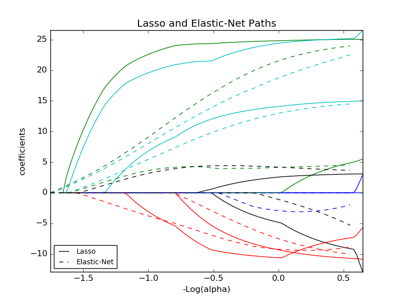

:class:`ElasticNetCV` 可以通过交叉验证来用来设置参数 ``alpha`` (:math:`\alpha`) 和 ``l1_ratio`` (:math:`\rho`)

.. topic:: Examples:

  * :ref:`example_linear_model_plot_lasso_and_elasticnet.py`
  * :ref:`example_linear_model_plot_lasso_coordinate_descent_path.py`

.. _multi_task_lasso:

Multi-task Lasso
================

The :class:`MultiTaskLasso` is a linear model that estimates sparse
coefficients for multiple regression problems jointly: ``y`` is a 2D array,
of shape (n_samples, n_tasks). The constraint is that the selected
features are the same for all the regression problems, also called tasks.

The following figure compares the location of the non-zeros in W obtained
with a simple Lasso or a MultiTaskLasso. The Lasso estimates yields
scattered non-zeros while the non-zeros of the MultiTaskLasso are full
columns.

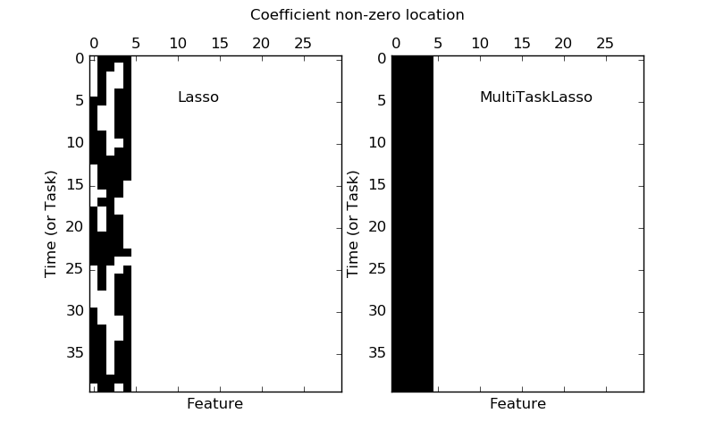

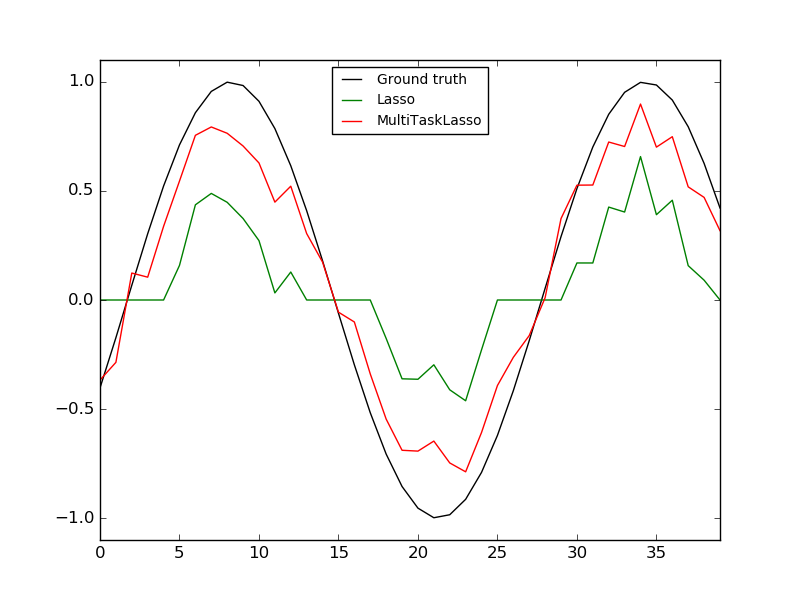

.. centered:: |multi_task_lasso_1| |multi_task_lasso_2|

.. centered:: Fitting a time-series model, imposing that any active feature be active at all times.

.. topic:: Examples:

  * :ref:`example_linear_model_plot_multi_task_lasso_support.py`

Mathematically, it consists of a linear model trained with a mixed
:math:`\ell_1` :math:`\ell_2` prior as regularizer.
The objective function to minimize is:

.. math::  \underset{w}{min\,} { \frac{1}{2n_{samples}} ||X W - Y||_2 ^ 2 + \alpha ||W||_{21}}

where;

.. math:: ||W||_{2 1} = \sum_i \sqrt{\sum_j w_{ij}^2}

The implementation in the class :class:`MultiTaskLasso` uses coordinate descent as
the algorithm to fit the coefficients.

.. _least_angle_regression:

Least Angle Regression
======================

Least-angle regression (LARS) is a regression algorithm for
high-dimensional data, developed by Bradley Efron, Trevor Hastie, Iain
Johnstone and Robert Tibshirani.

The advantages of LARS are:

  - It is numerically efficient in contexts where p >> n (i.e., when the
    number of dimensions is significantly greater than the number of
    points)

  - It is computationally just as fast as forward selection and has
    the same order of complexity as an ordinary least squares.

  - It produces a full piecewise linear solution path, which is
    useful in cross-validation or similar attempts to tune the model.

  - If two variables are almost equally correlated with the response,
    then their coefficients should increase at approximately the same
    rate. The algorithm thus behaves as intuition would expect, and
    also is more stable.

  - It is easily modified to produce solutions for other estimators,
    like the Lasso.

The disadvantages of the LARS method include:

  - Because LARS is based upon an iterative refitting of the
    residuals, it would appear to be especially sensitive to the
    effects of noise. This problem is discussed in detail by Weisberg
    in the discussion section of the Efron et al. (2004) Annals of
    Statistics article.

The LARS model can be used using estimator :class:`Lars`, or its
low-level implementation :func:`lars_path`.

LARS Lasso
==========

:class:`LassoLars` is a lasso model implemented using the LARS
algorithm, and unlike the implementation based on coordinate_descent,
this yields the exact solution, which is piecewise linear as a
function of the norm of its coefficients.

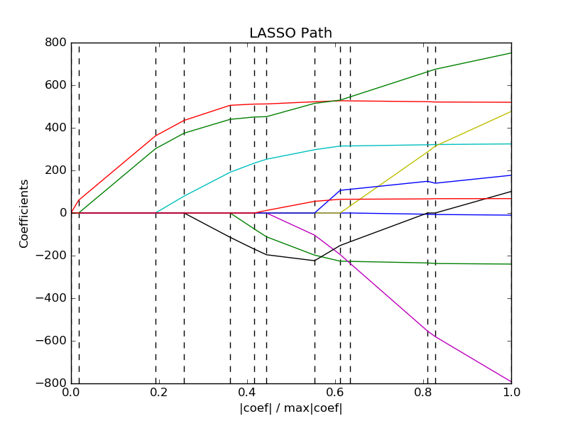

::

   >>> from sklearn import linear_model
   >>> clf = linear_model.LassoLars(alpha=.1)
   >>> clf.fit([[0, 0], [1, 1]], [0, 1])  # doctest: +ELLIPSIS, +NORMALIZE_WHITESPACE
   LassoLars(alpha=0.1, copy_X=True, eps=..., fit_intercept=True,
        fit_path=True, max_iter=500, normalize=True, positive=False,
        precompute='auto', verbose=False)
   >>> clf.coef_    # doctest: +ELLIPSIS
   array([ 0.717157...,  0.        ])

.. topic:: Examples:

 * :ref:`example_linear_model_plot_lasso_lars.py`

The Lars algorithm provides the full path of the coefficients along
the regularization parameter almost for free, thus a common operation
consist of retrieving the path with function :func:`lars_path`

Mathematical formulation
------------------------

The algorithm is similar to forward stepwise regression, but instead
of including variables at each step, the estimated parameters are
increased in a direction equiangular to each one's correlations with
the residual.

Instead of giving a vector result, the LARS solution consists of a
curve denoting the solution for each value of the L1 norm of the
parameter vector. The full coefficients path is stored in the array
``coef_path_``, which has size (n_features, max_features+1). The first
column is always zero.

.. topic:: References:

 * Original Algorithm is detailed in the paper `Least Angle Regression
   <http://www-stat.stanford.edu/~hastie/Papers/LARS/LeastAngle_2002.pdf>`_
   by Hastie et al.

.. _omp:

Orthogonal Matching Pursuit (OMP)
=================================
:class:`OrthogonalMatchingPursuit` and :func:`orthogonal_mp` implements the OMP
algorithm for approximating the fit of a linear model with constraints imposed
on the number of non-zero coefficients (ie. the L :sub:`0` pseudo-norm).

Being a forward feature selection method like :ref:`least_angle_regression`,
orthogonal matching pursuit can approximate the optimum solution vector with a
fixed number of non-zero elements:

.. math:: \text{arg\,min\,} ||y - X\gamma||_2^2 \text{ subject to } \
    ||\gamma||_0 \leq n_{nonzero\_coefs}

Alternatively, orthogonal matching pursuit can target a specific error instead
of a specific number of non-zero coefficients. This can be expressed as:

.. math:: \text{arg\,min\,} ||\gamma||_0 \text{ subject to } ||y-X\gamma||_2^2 \
    \leq \text{tol}

OMP is based on a greedy algorithm that includes at each step the atom most
highly correlated with the current residual. It is similar to the simpler
matching pursuit (MP) method, but better in that at each iteration, the
residual is recomputed using an orthogonal projection on the space of the
previously chosen dictionary elements.

.. topic:: Examples:

 * :ref:`example_linear_model_plot_omp.py`

.. topic:: References:

 * http://www.cs.technion.ac.il/~ronrubin/Publications/KSVD-OMP-v2.pdf

 * `Matching pursuits with time-frequency dictionaries
   <http://blanche.polytechnique.fr/~mallat/papiers/MallatPursuit93.pdf>`_,
   S. G. Mallat, Z. Zhang,

.. _bayesian_regression:

Bayesian Regression
===================

可以在估计过程中使用贝叶斯回归技术包含正则化参数：正则化参数不是硬编码设置的而是手动调节适合数据的值
Bayesian regression techniques can be used to include regularization
parameters in the estimation procedure: the regularization parameter is
not set in a hard sense but tuned to the data at hand.

可以通过引入 `uninformative priors
<http://en.wikipedia.org/wiki/Non-informative_prior#Uninformative_priors>`__

This can be done by introducing `uninformative priors
<http://en.wikipedia.org/wiki/Non-informative_prior#Uninformative_priors>`__
over the hyper parameters of the model.
The :math:`\ell_{2}` regularization used in `Ridge Regression`_ is equivalent
to finding a maximum a-postiori solution under a Gaussian prior over the
parameters :math:`w` with precision :math:`\lambda^-1`.  Instead of setting
`\lambda` manually, it is possible to treat it as a random variable to be
estimated from the data.

为了获得一个完整的概率模型，输出 :math:`y` 假设为关于 :math:`X w` 的高斯分布
To obtain a fully probabilistic model, the output :math:`y` is assumed
to be Gaussian distributed around :math:`X w`:

.. math::  p(y|X,w,\alpha) = \mathcal{N}(y|X w,\alpha)

Alpha 同样被看做是随机变量，需要从数据中来估计
Alpha is again treated as a random variable that is to be estimated from the
data.

贝叶斯回归的优势：

	- 根据数据调节参数
	- 在估计过程中包含正则化参数

贝叶斯回归劣势:

    - Inference of the model can be time consuming.

.. topic:: References

 * A good introduction to Bayesian methods is given in C. Bishop: Pattern
   Recognition and Machine learning

 * Original Algorithm is detailed in the  book `Bayesian learning for neural
   networks` by Radford M. Neal

.. _bayesian_ridge_regression:

Bayesian Ridge Regression
-------------------------

:class:`BayesianRidge` estimates a probabilistic model of the
regression problem as described above.
The prior for the parameter :math:`w` is given by a spherical Gaussian:

.. math:: p(w|\lambda) =
    \mathcal{N}(w|0,\lambda^{-1}\bold{I_{p}})

The priors over :math:`\alpha` and :math:`\lambda` are chosen to be `gamma
distributions <http://en.wikipedia.org/wiki/Gamma_distribution>`__, the
conjugate prior for the precision of the Gaussian.

The resulting model is called *Bayesian Ridge Regression*, and is similar to the
classical :class:`Ridge`.  The parameters :math:`w`, :math:`\alpha` and
:math:`\lambda` are estimated jointly during the fit of the model.  The
remaining hyperparameters are the parameters of the gamma priors over
:math:`\alpha` and :math:`\lambda`.  These are usually chosen to be
*non-informative*.  The parameters are estimated by maximizing the *marginal
log likelihood*.

By default :math:`\alpha_1 = \alpha_2 =  \lambda_1 = \lambda_2 = 1.e^{-6}`.

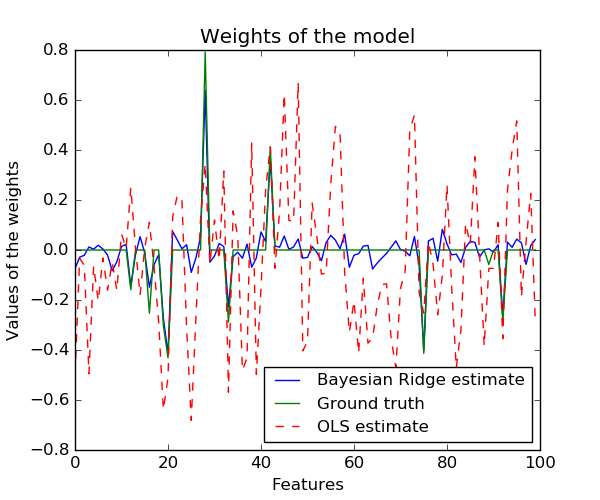

Bayesian Ridge Regression is used for regression::

    >>> from sklearn import linear_model
    >>> X = [[0., 0.], [1., 1.], [2., 2.], [3., 3.]]
    >>> Y = [0., 1., 2., 3.]
    >>> clf = linear_model.BayesianRidge()
    >>> clf.fit(X, Y)
    BayesianRidge(alpha_1=1e-06, alpha_2=1e-06, compute_score=False, copy_X=True,
           fit_intercept=True, lambda_1=1e-06, lambda_2=1e-06, n_iter=300,
           normalize=False, tol=0.001, verbose=False)

After being fitted, the model can then be used to predict new values::

    >>> clf.predict ([[1, 0.]])
    array([ 0.50000013])

The weights :math:`w` of the model can be access::

    >>> clf.coef_
    array([ 0.49999993,  0.49999993])

Due to the Bayesian framework, the weights found are slightly different to the
ones found by :ref:`ordinary_least_squares`. However, Bayesian Ridge Regression
is more robust to ill-posed problem.

.. topic:: Examples:

 * :ref:`example_linear_model_plot_bayesian_ridge.py`

.. topic:: References

  * More details can be found in the article `Bayesian Interpolation
    <http://citeseerx.ist.psu.edu/viewdoc/download?doi=10.1.1.27.9072&rep=rep1&type=pdf>`_
    by MacKay, David J. C.

Automatic Relevance Determination - ARD
---------------------------------------

:class:`ARDRegression` is very similar to `Bayesian Ridge Regression`_,
but can lead to sparser weights :math:`w` [1]_ [2]_.
:class:`ARDRegression` poses a different prior over :math:`w`, by dropping the
assumption of the Gaussian being spherical.

Instead, the distribution over :math:`w` is assumed to be an axis-parallel,
elliptical Gaussian distribution.

This means each weight :math:`w_{i}` is drawn from a Gaussian distribution,
centered on zero and with a precision :math:`\lambda_{i}`:

.. math:: p(w|\lambda) = \mathcal{N}(w|0,A^{-1})

with :math:`diag \; (A) = \lambda = \{\lambda_{1},...,\lambda_{p}\}`.

In contrast to `Bayesian Ridge Regression`_, each coordinate of :math:`w_{i}`
has its own standard deviation :math:`\lambda_i`. The prior over all
:math:`\lambda_i` is chosen to be the same gamma distribution given by
hyperparameters :math:`\lambda_1` and :math:`\lambda_2`.

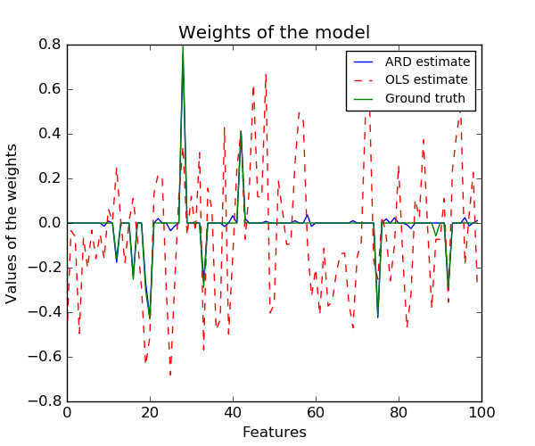

.. topic:: Examples:

  * :ref:`example_linear_model_plot_ard.py`

.. topic:: References:

    .. [1] Christopher M. Bishop: Pattern Recognition and Machine Learning, Chapter 7.2.1

    .. [2] David Wipf and Srikantan Nagarajan: `A new view of automatic relevance determination. <http://books.nips.cc/papers/files/nips20/NIPS2007_0976.pdf>`_

.. _Logistic_regression:

Logistic regression
===================

Logistic regression, despite its name, is a linear model for classification
rather than regression. Logistic regression is also known in the literature as
logit regression, maximum-entropy classification (MaxEnt)
or the log-linear classifier. In this model, the probabilities describing the possible outcomes of a single trial are modeled using a `logistic function <http://en.wikipedia.org/wiki/Logistic_function>`_.

The implementation of logistic regression in scikit-learn can be accessed from
class :class:`LogisticRegression`. This
implementation can fit a multiclass (one-vs-rest) logistic regression with optional
L2 or L1 regularization.

As an optimization problem, binary class L2 penalized logistic regression minimizes
the following cost function:

.. math:: \underset{w, c}{min\,} \frac{1}{2}w^T w + C \sum_{i=1}^n \log(\exp(- y_i (X_i^T w + c)) + 1) .

Similarly, L1 regularized logistic regression solves the following optimization problem

.. math:: \underset{w, c}{min\,} \|w\|_1 + C \sum_{i=1}^n \log(\exp(- y_i (X_i^T w + c)) + 1) .

The solvers implemented in the class :class:`LogisticRegression`
are "liblinear" (which is a wrapper around the C++ library,
LIBLINEAR), "newton-cg", "lbfgs" and "sag".

The "lbfgs" and "newton-cg" solvers only support L2 penalization and are found
to converge faster for some high dimensional data. L1 penalization yields
sparse predicting weights.

The solver "liblinear" uses a coordinate descent (CD) algorithm based on
Liblinear. For L1 penalization :func:`sklearn.svm.l1_min_c` allows to
calculate the lower bound for C in order to get a non "null" (all feature weights to
zero) model. This relies on the excellent
`LIBLINEAR library <http://www.csie.ntu.edu.tw/~cjlin/liblinear/>`_,
which is shipped with scikit-learn. However, the CD algorithm implemented in
liblinear cannot learn a true multinomial (multiclass) model;
instead, the optimization problem is decomposed in a "one-vs-rest" fashion
so separate binary classifiers are trained for all classes.
This happens under the hood, so :class:`LogisticRegression` instances
using this solver behave as multiclass classifiers.

Setting `multi_class` to "multinomial" with the "lbfgs" or "newton-cg" solver
in :class:`LogisticRegression` learns a true multinomial logistic
regression model, which means that its probability estimates should
be better calibrated than the default "one-vs-rest" setting.
"lbfgs", "newton-cg" and "sag" solvers cannot optimize L1-penalized models, though, so the "multinomial" setting does not learn sparse models.

The solver "sag" uses a Stochastic Average Gradient descent [3]_. It does not
handle "multinomial" case, and is limited to L2-penalized models, yet it is
often faster than other solvers for large datasets, when both the number of
samples and the number of features are large.

In a nutshell, one may choose the solver with the following rules:

===========================   ======================
Case                          Solver
===========================   ======================
Small dataset or L1 penalty   "liblinear"
Multinomial loss              "lbfgs" or newton-cg"
Large dataset                 "sag"
===========================   ======================

For large dataset, you may also consider using :class:`SGDClassifier` with 'log' loss.

.. topic:: Examples:

  * :ref:`example_linear_model_plot_logistic_l1_l2_sparsity.py`

  * :ref:`example_linear_model_plot_logistic_path.py`

.. _liblinear_differences:

.. topic:: Differences from liblinear:

   There might be a difference in the scores obtained between
   :class:`LogisticRegression` with ``solver=liblinear``
   or :class:`LinearSVC` and the external liblinear library directly,
   when ``fit_intercept=False`` and the fit ``coef_`` (or) the data to
   be predicted are zeroes. This is because for the sample(s) with
   ``decision_function`` zero, :class:`LogisticRegression` and :class:`LinearSVC`
   predict the negative class, while liblinear predicts the positive class.
   Note that a model with ``fit_intercept=False`` and having many samples with
   ``decision_function`` zero, is likely to be a underfit, bad model and you are
   advised to set ``fit_intercept=True`` and increase the intercept_scaling.

.. note:: **Feature selection with sparse logistic regression**

   A logistic regression with L1 penalty yields sparse models, and can
   thus be used to perform feature selection, as detailed in
   :ref:`l1_feature_selection`.

:class:`LogisticRegressionCV` implements Logistic Regression with
builtin cross-validation to find out the optimal C parameter.
"newton-cg", "sag" and "lbfgs" solvers are found to be faster
for high-dimensional dense data, due to warm-starting.
For the multiclass case, if `multi_class`
option is set to "ovr", an optimal C is obtained for each class and if
the `multi_class` option is set to "multinomial", an optimal C is
obtained that minimizes the cross-entropy loss.

.. topic:: References:

    .. [3] Mark Schmidt, Nicolas Le Roux, and Francis Bach: `Minimizing Finite Sums with the Stochastic Average Gradient. <http://hal.inria.fr/hal-00860051/PDF/sag_journal.pdf>`_

Stochastic Gradient Descent - SGD
=================================

Stochastic gradient descent is a simple yet very efficient approach
to fit linear models. It is particularly useful when the number of samples
(and the number of features) is very large.
The ``partial_fit`` method allows only/out-of-core learning.

The classes :class:`SGDClassifier` and :class:`SGDRegressor` provide
functionality to fit linear models for classification and regression
using different (convex) loss functions and different penalties.
E.g., with ``loss="log"``, :class:`SGDClassifier`
fits a logistic regression model,
while with ``loss="hinge"`` it fits a linear support vector machine (SVM).

.. topic:: References

 * :ref:`sgd`

.. _perceptron:

Perceptron
==========

The :class:`Perceptron` is another simple algorithm suitable for large scale
learning. By default:

    - It does not require a learning rate.

    - It is not regularized (penalized).

    - It updates its model only on mistakes.

The last characteristic implies that the Perceptron is slightly faster to
train than SGD with the hinge loss and that the resulting models are
sparser.

.. _passive_aggressive:

Passive Aggressive Algorithms
=============================

The passive-aggressive algorithms are a family of algorithms for large-scale
learning. They are similar to the Perceptron in that they do not require a
learning rate. However, contrary to the Perceptron, they include a
regularization parameter ``C``.

For classification, :class:`PassiveAggressiveClassifier` can be used with
``loss='hinge'`` (PA-I) or ``loss='squared_hinge'`` (PA-II).  For regression,
:class:`PassiveAggressiveRegressor` can be used with
``loss='epsilon_insensitive'`` (PA-I) or
``loss='squared_epsilon_insensitive'`` (PA-II).

.. topic:: References:

 * `"Online Passive-Aggressive Algorithms"
   <http://jmlr.csail.mit.edu/papers/volume7/crammer06a/crammer06a.pdf>`_
   K. Crammer, O. Dekel, J. Keshat, S. Shalev-Shwartz, Y. Singer - JMLR 7 (2006)

Robustness regression: outliers and modeling errors
=====================================================

Robust regression is interested in fitting a regression model in the
presence of corrupt data: either outliers, or error in the model.

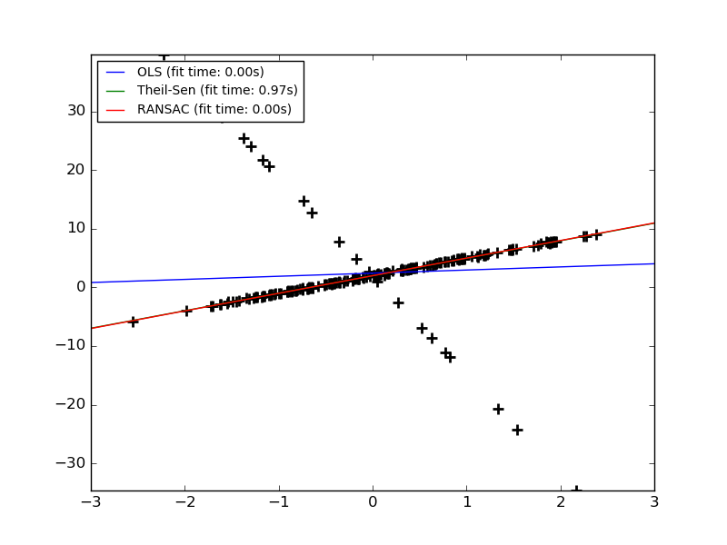

Different scenario and useful concepts
----------------------------------------

There are different things to keep in mind when dealing with data
corrupted by outliers:

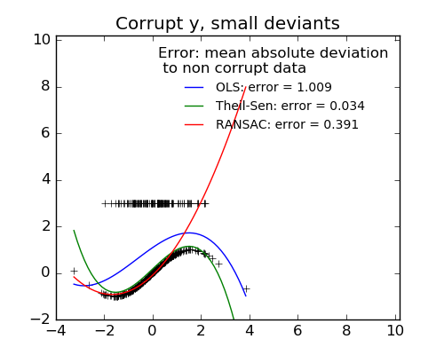

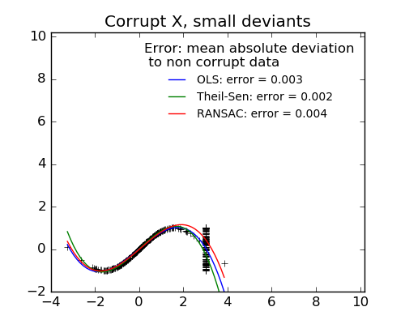

.. |large_y_outliers| image:: ../auto_examples/linear_model/images/plot_robust_fit_005.png
   :target: ../auto_examples/linear_model/plot_robust_fit.html
   :scale: 60%

* **Outliers in X or in y**?

  ==================================== ====================================
  Outliers in the y direction          Outliers in the X direction
  ==================================== ====================================
  |y_outliers|                         |X_outliers|
  ==================================== ====================================

* **Fraction of outliers versus amplitude of error**

  The number of outlying points matters, but also how much they are
  outliers.

  ==================================== ====================================
  Small outliers                       Large outliers
  ==================================== ====================================
  |y_outliers|                         |large_y_outliers|
  ==================================== ====================================

An important notion of robust fitting is that of breakdown point: the
fraction of data that can be outlying for the fit to start missing the
inlying data.

Note that in general, robust fitting in high-dimensional setting (large
`n_features`) is very hard. The robust models here will probably not work
in these settings.

.. topic:: **Trade-offs: which estimator?**

   Scikit-learn provides 2 robust regression estimators:
   :ref:`RANSAC <ransac_regression>` and
   :ref:`Theil Sen <theil_sen_regression>`

   * :ref:`RANSAC <ransac_regression>` is faster, and scales much better
     with the number of samples

   * :ref:`RANSAC <ransac_regression>` will deal better with large
     outliers in the y direction (most common situation)

  * :ref:`Theil Sen <theil_sen_regression>` will cope better with
    medium-size outliers in the X direction, but this property will
    disappear in large dimensional settings.

 When in doubt, use :ref:`RANSAC <ransac_regression>`

.. _ransac_regression:

RANSAC: RANdom SAmple Consensus
--------------------------------

RANSAC (RANdom SAmple Consensus) fits a model from random subsets of
inliers from the complete data set.

RANSAC is a non-deterministic algorithm producing only a reasonable result with
a certain probability, which is dependent on the number of iterations (see
`max_trials` parameter). It is typically used for linear and non-linear
regression problems and is especially popular in the fields of photogrammetric
computer vision.

The algorithm splits the complete input sample data into a set of inliers,
which may be subject to noise, and outliers, which are e.g. caused by erroneous
measurements or invalid hypotheses about the data. The resulting model is then
estimated only from the determined inliers.

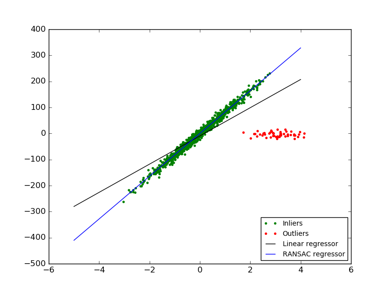

Details of the algorithm
^^^^^^^^^^^^^^^^^^^^^^^^

Each iteration performs the following steps:

1. Select ``min_samples`` random samples from the original data and check
   whether the set of data is valid (see ``is_data_valid``).
2. Fit a model to the random subset (``base_estimator.fit``) and check
   whether the estimated model is valid (see ``is_model_valid``).
3. Classify all data as inliers or outliers by calculating the residuals
   to the estimated model (``base_estimator.predict(X) - y``) - all data
   samples with absolute residuals smaller than the ``residual_threshold``
   are considered as inliers.
4. Save fitted model as best model if number of inlier samples is
   maximal. In case the current estimated model has the same number of
   inliers, it is only considered as the best model if it has better score.

These steps are performed either a maximum number of times (``max_trials``) or
until one of the special stop criteria are met (see ``stop_n_inliers`` and
``stop_score``). The final model is estimated using all inlier samples (consensus
set) of the previously determined best model.

The ``is_data_valid`` and ``is_model_valid`` functions allow to identify and reject
degenerate combinations of random sub-samples. If the estimated model is not
needed for identifying degenerate cases, ``is_data_valid`` should be used as it
is called prior to fitting the model and thus leading to better computational
performance.

.. topic:: Examples:

  * :ref:`example_linear_model_plot_ransac.py`
  * :ref:`example_linear_model_plot_robust_fit.py`

.. topic:: References:

 * http://en.wikipedia.org/wiki/RANSAC
 * `"Random Sample Consensus: A Paradigm for Model Fitting with Applications to
   Image Analysis and Automated Cartography"
   <http://www.cs.columbia.edu/~belhumeur/courses/compPhoto/ransac.pdf>`_
   Martin A. Fischler and Robert C. Bolles - SRI International (1981)
 * `"Performance Evaluation of RANSAC Family"
   <http://www.bmva.org/bmvc/2009/Papers/Paper355/Paper355.pdf>`_
   Sunglok Choi, Taemin Kim and Wonpil Yu - BMVC (2009)

.. _theil_sen_regression:

Theil-Sen estimator: generalized-median-based estimator
--------------------------------------------------------

The :class:`TheilSenRegressor` estimator uses a generalization of the median in
multiple dimensions. It is thus robust to multivariate outliers. Note however
that the robustness of the estimator decreases quickly with the dimensionality
of the problem. It looses its robustness properties and becomes no
better than an ordinary least squares in high dimension.

.. topic:: Examples:

  * :ref:`example_linear_model_plot_theilsen.py`
  * :ref:`example_linear_model_plot_robust_fit.py`

.. topic:: References:

 * http://en.wikipedia.org/wiki/Theil%E2%80%93Sen_estimator

Theoretical considerations
^^^^^^^^^^^^^^^^^^^^^^^^^^

:class:`TheilSenRegressor` is comparable to the :ref:`Ordinary Least Squares
(OLS) <ordinary_least_squares>` in terms of asymptotic efficiency and as an
unbiased estimator. In contrast to OLS, Theil-Sen is a non-parametric
method which means it makes no assumption about the underlying
distribution of the data. Since Theil-Sen is a median-based estimator, it
is more robust against corrupted data aka outliers. In univariate
setting, Theil-Sen has a breakdown point of about 29.3% in case of a
simple linear regression which means that it can tolerate arbitrary
corrupted data of up to 29.3%.

The implementation of :class:`TheilSenRegressor` in scikit-learn follows a
generalization to a multivariate linear regression model [#f1]_ using the
spatial median which is a generalization of the median to multiple
dimensions [#f2]_.

In terms of time and space complexity, Theil-Sen scales according to

.. math::
    \binom{n_{samples}}{n_{subsamples}}

which makes it infeasible to be applied exhaustively to problems with a
large number of samples and features. Therefore, the magnitude of a
subpopulation can be chosen to limit the time and space complexity by
considering only a random subset of all possible combinations.

.. topic:: Examples:

  * :ref:`example_linear_model_plot_theilsen.py`

.. topic:: References:

    .. [#f1] Xin Dang, Hanxiang Peng, Xueqin Wang and Heping Zhang: `Theil-Sen Estimators in a Multiple Linear Regression Model. <http://www.math.iupui.edu/~hpeng/MTSE_0908.pdf>`_

    .. [#f2] T. Kärkkäinen and S. Äyrämö: `On Computation of Spatial Median for Robust Data Mining. <http://users.jyu.fi/~samiayr/pdf/ayramo_eurogen05.pdf>`_

.. _polynomial_regression:

Polynomial regression: extending linear models with basis functions
===================================================================

.. currentmodule:: sklearn.preprocessing

One common pattern within machine learning is to use linear models trained
on nonlinear functions of the data.  This approach maintains the generally
fast performance of linear methods, while allowing them to fit a much wider
range of data.

For example, a simple linear regression can be extended by constructing
**polynomial features** from the coefficients.  In the standard linear
regression case, you might have a model that looks like this for
two-dimensional data:

.. math::    \hat{y}(w, x) = w_0 + w_1 x_1 + w_2 x_2

If we want to fit a paraboloid to the data instead of a plane, we can combine
the features in second-order polynomials, so that the model looks like this:

.. math::    \hat{y}(w, x) = w_0 + w_1 x_1 + w_2 x_2 + w_3 x_1 x_2 + w_4 x_1^2 + w_5 x_2^2

The (sometimes surprising) observation is that this is *still a linear model*:
to see this, imagine creating a new variable

.. math::  z = [x_1, x_2, x_1 x_2, x_1^2, x_2^2]

With this re-labeling of the data, our problem can be written

.. math::    \hat{y}(w, x) = w_0 + w_1 z_1 + w_2 z_2 + w_3 z_3 + w_4 z_4 + w_5 z_5

We see that the resulting *polynomial regression* is in the same class of
linear models we'd considered above (i.e. the model is linear in :math:`w`)
and can be solved by the same techniques.  By considering linear fits within
a higher-dimensional space built with these basis functions, the model has the
flexibility to fit a much broader range of data.

Here is an example of applying this idea to one-dimensional data, using
polynomial features of varying degrees:

.. figure:: ../auto_examples/linear_model/images/plot_polynomial_interpolation_001.png
   :target: ../auto_examples/linear_model/plot_polynomial_interpolation.html
   :align: center
   :scale: 50%

This figure is created using the :class:`PolynomialFeatures` preprocessor.
This preprocessor transforms an input data matrix into a new data matrix
of a given degree.  It can be used as follows::

    >>> from sklearn.preprocessing import PolynomialFeatures
    >>> import numpy as np
    >>> X = np.arange(6).reshape(3, 2)
    >>> X
    array([[0, 1],
           [2, 3],
           [4, 5]])
    >>> poly = PolynomialFeatures(degree=2)
    >>> poly.fit_transform(X)
    array([[  1.,   0.,   1.,   0.,   0.,   1.],
           [  1.,   2.,   3.,   4.,   6.,   9.],
           [  1.,   4.,   5.,  16.,  20.,  25.]])

The features of ``X`` have been transformed from :math:`[x_1, x_2]` to
:math:`[1, x_1, x_2, x_1^2, x_1 x_2, x_2^2]`, and can now be used within
any linear model.

This sort of preprocessing can be streamlined with the
:ref:`Pipeline <pipeline>` tools. A single object representing a simple
polynomial regression can be created and used as follows::

    >>> from sklearn.preprocessing import PolynomialFeatures
    >>> from sklearn.linear_model import LinearRegression
    >>> from sklearn.pipeline import Pipeline
    >>> import numpy as np
    >>> model = Pipeline([('poly', PolynomialFeatures(degree=3)),
    ...                   ('linear', LinearRegression(fit_intercept=False))])
    >>> # fit to an order-3 polynomial data
    >>> x = np.arange(5)
    >>> y = 3 - 2 * x + x ** 2 - x ** 3
    >>> model = model.fit(x[:, np.newaxis], y)
    >>> model.named_steps['linear'].coef_
    array([ 3., -2.,  1., -1.])

The linear model trained on polynomial features is able to exactly recover
the input polynomial coefficients.

In some cases it's not necessary to include higher powers of any single feature,
but only the so-called *interaction features*
that multiply together at most :math:`d` distinct features.
These can be gotten from :class:`PolynomialFeatures` with the setting
``interaction_only=True``.

For example, when dealing with boolean features,
:math:`x_i^n = x_i` for all :math:`n` and is therefore useless;
but :math:`x_i x_j` represents the conjunction of two booleans.
This way, we can solve the XOR problem with a linear classifier::

    >>> from sklearn.linear_model import Perceptron
    >>> from sklearn.preprocessing import PolynomialFeatures
    >>> import numpy as np
    >>> X = np.array([[0, 0], [0, 1], [1, 0], [1, 1]])
    >>> y = X[:, 0] ^ X[:, 1]
    >>> X = PolynomialFeatures(interaction_only=True).fit_transform(X)
    >>> X
    array([[ 1.,  0.,  0.,  0.],
           [ 1.,  0.,  1.,  0.],
           [ 1.,  1.,  0.,  0.],
           [ 1.,  1.,  1.,  1.]])
    >>> clf = Perceptron(fit_intercept=False, n_iter=10, shuffle=False).fit(X, y)
    >>> clf.score(X, y)
    1.0

